Производство
============

Как мы уже отмечали в самой первой главе книги, программа «1С:Управление
небольшой фирмой 8» имеет в своем составе возможности, связанные с
планированием и учетом производственной деятельности. Рассмотрим эти
возможности.

Продукция, ее состав и технологические операции производства
------------------------------------------------------------

Перечень выпускаемой продукции хранится в справочнике Номенклатура, при
этом сами номенклатурные единицы продукции имеют тип Запас. Для
номенклатурной единицы, являющейся продукцией, а не товаром или
материалом, можно установить способ пополнения по умолчанию –
производство (реквизит Способ   пополнения на вкладке Параметры хранения
и закупки – см. рисунок 5.1).

|image0|

Рисунок 5.1. Указание способа пополнения по умолчанию и спецификации в
карточке номенклатуры

Установка способа пополнения Производство вовсе не означает, что данная
номенклатурная единица всегда будет учитываться в программе как
продукция. С таким же успехом ее можно будет закупать у поставщиков,
если в этом возникнет необходимость.

Какие материалы (сырье) используются при выпуске продукции, и какие
технологические операции при этом выполняются, определяет Спецификация.
Спецификаций может быть несколько для одной и той же единицы продукции.
Но, как правило, одна из них является основной, ее и можно указать в
карточке номенклатуры на вкладке Параметры хранения и закупки. См.
рисунок 5.1. Перечень всех спецификаций номенклатурной позиции можно
увидеть, нажав на ссылку Спецификации в левой части карточки
номенклатуры (в группе См. также). См. рисунки 5.1, 5.2.

Следует отметить, что если продукция имеет дополнительные характеристики
(например, различается по цветам, размерам и т. п.), то спецификацию
необходимо ввести для каждой характеристики. Действительно, ведь в
состав разных вариантов продукции могут входить, например, материалы
разных цветовых гамм. Такой пример как раз показан на рисунке 5.2: для
производства спортивного комплекса «Макси» красной расцветки
используется спецификация «Комплекс Макси – красный», для производства
того же комплекса морской расцветки – спецификация «Комплекс Макси –
синий» или «Комплекс Макси – синий – доп. спецификация», а для
производства комплекса темной расцветки – «Комплекс Макси – темный».
Кроме того, в списке спецификаций присутствует и базовая спецификация,
не различающаяся по цветам.

|image1|

Рисунок 5.2. Перечень спецификаций продукции

Табличная часть каждой спецификации может содержать две вкладки – Состав
и Операции.

|image2|

Рисунок 5.3 Спецификация, вкладка «Состав»

Вкладка Состав определяет перечень и количество материалов (сырья),
необходимых для производства продукции. Состав реквизитов табличной
части вкладки Состав описан ниже.

Тип строки может принимать следующие значения:

-  Материал – материалы и сырье, закупаемые у поставщиков.

-  Сборка – полуфабрикат, который производится на предприятии.

-  Узел – набор из нескольких номенклатурных позиций; его характерная
   особенность в том, что он не учитывается как самостоятельная единица,
   т. е. не существует физически, не лежит на складе, а собирается из
   составляющих непосредственно в момент его использования.

-  Расход – услуга контрагентов, имеющая производственный характер, и
   входящая в состав прямых затрат.

Номенклатура, Характеристика, Ед. – номенклатурная единица материала
(сырья), его характеристика, единица измерения.

Количество – норма расхода номенклатуры на изготовление количества
продукции, указанного далее в реквизите Количество продукции.

Доля стоимости – доля стоимости запаса, получаемого в результате
разборки (разделки) от стоимости исходной номенклатуры.

Для номенклатуры типа Сборка или Узел указывается также спецификация, по
которой, в свою очередь, производится эта сборка или узел (реквизит
Спецификация табличной части).

Далее перейдем к вкладке Операции.

Вкладка Операции определяет состав технологических операций
производства.

|image3|

Рисунок 5.4. Спецификация, вкладка «Операции»

В табличной части на вкладке Операции указываются:

Операция – технологическая операция процесса изготовления изделия,
выбирается из справочника

Номенклатура из числа номенклатурных позиций с типом Операция.

Норма времени – нормативное время выполнения операции, указывается в
часах.

Количество продукции – количество продукции, в расчете на которое
указана норма времени выполнения операции.

Говоря о технологических операциях, надо отметить, что если в настройках
не установлен флажок Использовать  технологические  операции  в
 спецификациях  изготовления  изделий,  сдельных нарядах, то вкладки
Операции в спецификациях мы не увидим. Вкладка же Состав будет
присутствовать в любом случае.

Для контроля нормативного состав выпускаемой продукции можно
использовать отчет Нормативный состав изделия, который расположен в
разделе Производство. Пример отчета представлен на рисунке 5.5.

Отчет состоит из двух таблиц: верхняя показывает плановый расход
материалов, нижняя – технологические операции, которые требуется
выполнить в процессе производства.

|image4|

Рисунок 5.5. Отчет «Нормативный состав изделия»

Обратим внимание на то, что если в составе спецификации присутствуют
узлы или сборка, то в отчете

Нормативный состав изделия они разворачиваются до конечных материалов и
техопераций. Такой пример –

«Упаковка для спорткомплекса» в отчете на рисунке 5.5. Упаковка состоит
из коробки картонной и скотча (видим в верхней части отчета), при этом
технологических операции по собиранию узла нет (последняя строка отчета
не расшифрована).

Нетрудно догадаться, что отчет Нормативный состав изделия может быть
использован для получения данных о плановой себестоимости. Однако, для
того, чтобы в отчете были данные в суммовом выражении, для материалов и
тех.операций в программу должны быть введены цены (расценки). В нашем
случае (рисунок 5.5) они в программу введены с видом цен «Учетная цена».
Поскольку цены (расценки) могут меняться с течением времени, при
формировании отчета всегда указывайте дату расчета, программа возьмет
значения цен именно на эту дату. Зная, например, о грядущем повышении
цен поставщиков материалов на N% с такого-то числа, вы можете заранее
ввести в программу эти цены (быстро и удобно это сделать обработкой
Формирование цен) и затем с помощью отчета Нормативный состав изделия
проанализировать, как это повышение повлияет на будущую себестоимость
продукции.

Ресурсы предприятия
-------------------

О ресурсах мы уже говорили в главе, посвященной вводу начальных данных.
Напомним, что ресурсами предприятия в программе называются любые
производственные ресурсы (оборудование, инвентарь, механизмы, бригады
рабочих, отдельные работники и так далее), загрузку которых
целесообразно планировать. Это планирование выполняется в документах
Заказ на производство и Заказ-наряд.

Список ресурсов доступен на панели навигации раздела Сервис или на
панели навигации раздела

Производство – см. рисунок 5.6

|image5|

Рисунок 5.6. Ресурсы предприятия

Каждый ресурс может относиться к какому-либо виду ресурсов. В примере,
показанном на рисунке 5.6., мы определили два вида ресурсов –
«Оборудование» и «Работники». Вид ресурсов «Все ресурсы» всегда
присутствует в программе. Непосредственно в карточке ресурса (рисунок
5.7) можно указать, к какому виду он относится, с помощью кнопки Указать
виды ресурсов в верхней части формы.

|image6|

Рисунок 5.7. Ресурс предприятия, связанный с бригадой

Каждый ресурс может быть связан с сотрудником или с бригадой
сотрудников, а может быть не связан ни с чем. На рисунке 5.7., показан
ресурс, связанный с бригадой.

Для каждого ресурса, помимо его наименования, задается Мощность
(значение доступности ресурса на интервале времени), по умолчанию
мощность равна 1. Мощность определяет, сколько заданий может выполнять
ресурс в один момент времени.

Для каждого ресурса также можно задать свой график работы, состоящий из
рабочего и нерабочего времени. Для этого сначала надо установить Текущий
график (выбирается из справочника Графики работы), а затем при
необходимости внести отклонения от него. Перед тем, как установить
график, выделите мышью тот интервал времени, для которого вы хотите это
сделать.

Для того, чтобы не возникло затруднений при вводе данные о графиках
работы ресурсов, заполните предварительно справочник Графики работы. Вы
найдете его на панели навигации раздела Зарплата. Дело в том, что
справочник Графики работы в программе один – он используется и для
ресурсов, и для сотрудников.

О том, как выполняется планирование ресурсов предприятия, вы узнаете,
прочитав следующий параграф.

Планирование производства
-------------------------

Планирование производства в программе «1С:Управление небольшой фирмой 8»
осуществляется с помощью ввода документов Заказ на производство.
Документ доступен на панели навигации раздела Производство. В случае,
когда производство является позаказным (что как раз и характерно для
небольших фирм), документы Заказ на производство целесообразно вводить
на основании заказов покупателей непосредственно в разделе Продажи (см.
рисунок 5.8).

|image7|

Рисунок 5.8. Ввод заказа на производство на основании заказа покупателя

Рассмотрим документ Заказ на производство. См. рисунок 5.9.

|image8|

Рисунок 5.9. Заказ на производство, вкладка «Продукция» В шапке
документа заполняем следующие реквизиты.

Организация – наша организация, от лица которой исполняется заказ.

Вид операции – Сборка или Разборка. В нашем примере – сборка (то есть
изготовление продукции из составляющих ее материалов).

Состояние. Если мы хотим, чтобы заказ сразу был включен в
производственный план, то необходимо установить в нем состояние, статус
которого – В работе, а не Открыт. По аналогии с заказами покупателей,
заказ на производство в состоянии со статусом Открыт – не более чем
запись в списке заказов. Перечень состояний заказов на производство
также настраивается пользователем программы в соответствии со спецификой
производственного процесса в конкретной компании, и хранится в
справочнике Состояния заказов на производство. Мы говорили о нем в
главе, посвященной вводу начальных данных.

Флажок Закрыт в заказе на производство имеет тот же смысл, что и в
заказах покупателей (напомним, что заказы покупателей мы рассматривали в
предыдущей главе). Поскольку наш заказ еще не закрыт, значение флажка не
устанавливаем.

Говоря о состояниях заказов на производство, подчеркнем, что, как и в
случае с заказами покупателей, здесь вы тоже можете не вести свой список
состояний заказов на производство, а отключить флажок Использовать
несколько состояний заказов на производство (три и более). Флажок
находится в разделе настроек Производство. При отключенном флажке любой
заказ на производство может быть только в одном из двух состояний – «в
работе» или «выполнен», что вы и указываете в нем одним щелчком мыши.
См. рисунок 5.10.

|image9|

Рисунок 5.10. Выбор состояния в заказе на производство в случае, когда
флаг «Использовать несколько состояний заказов

на производство (три и более) отключен Вернемся к рисунку 5.9.

Изготовитель – структурная единица компании, которая будет осуществлять
производственную деятельность. Это может быть как склад (например,
комплектация или упаковка, розлив на складе), так и подразделение.

Старт и Финиш определяют сроки производства. Эти значения рассчитываются
программой автоматически, исходя из предполагаемой даты отгрузки готовой
продукции покупателю (указанной в заказе покупателя) и длительности
производства (указанной в реквизите Срок исполнения, дн. для
производимой номенклатурной единицы в справочнике Номенклатура). При
необходимости, их можно изменить вручную. Если заказ

покупателя в заказе на производство не указан, старт и финиш
автоматически не рассчитываются, а заполняются только вручную.

Заказ покупателя – заказ покупателя, для обеспечения которого
предназначен данный заказ на производство. Указание заказа покупателя в
заказе на производство не является обязательным, так как производство не
 всегда может быть позаказным.

Табличная часть Продукция определяет, что именно и в каком количестве
должно быть произведено, а также – по какой спецификации. Обратите
внимание, что «по умолчанию» программа всегда поставляет в реквизит
Спецификация базовую спецификацию. Поэтому, обязательно проверьте, что у
вас в графе Спецификация для каждой номенклатурной позиции, прежде чем
переходить к табличной части Материалы.

Табличная часть Материалы документа Заказ на производство (рисунок 5.11)
определяет потребность в сырье и материалах для производства. Данные
здесь заполняются автоматически на основе спецификаций, указанных в
табличной части Продукция. При изменении хотя бы одного значения графы
Спецификация в табличной части Продукция (а это изменение возможно, как
мы отметили в предыдущем абзаце) следует заново заполнить табличную
часть, нажав на кнопку Заполнить по спецификации.

|image10|

Рисунок 5.11. Заказ на производство, вкладка «Материалы»

Склад резерва – склад, на котором резервируются материалы, необходимые
для производства по данному заказу на производство. Здесь необходимо
отметить, что фактически материалы будут зарезервированы не под заказ на
производство, а под заказ покупателя, во исполнение которого создан
данный заказ на производство. Графу В резерв можно заполнить
автоматически, для этого воспользуйтесь кнопкой Изменить резерв.

Вкладка Задействованные ресурсы предназначены для планирования
использования ресурсов предприятия.

|image11|

Рисунок 5.12. Заказ на производство, вкладка «Задействованные ресурсы»

Табличная часть на вкладке Задействованные ресурсы заполняется вручную.
Здесь необходимо указать наименование ресурса, календарный день, время
начала работы ресурса (Старт) и время окончания работы ресурса (Финиш).
Время работы ресурса не обязательно должно совпадать точно со временем
производства по заказу. Так в нашем примере производство начинается 14
августа в 00 часов и заканчивается 17 августа в 00 часов (см. рисунок
5.9), в то время как сборочный автомат используется 15 и 16 августа с 9
до 11 часов утра (см. рисунок 5.12).

Планируя использование ресурсов, необходимо знать, доступны ли нужные
нам ресурсы на интересующий интервал времени. Для получения такой
информации можно воспользоваться формой Планировщик. Она доступна на
панели навигации раздела Производство или раздела Сервис. Кстати говоря,
непосредственно из формы Планировщик можно также вводить документы Заказ
на производство. Что мы далее и сделаем.

|image12|

Рисунок 5.13. Планировщик, вкладка План-график

Планировщик содержит две вкладки План-график и Загрузка ресурсов (см.
рисунок 5.13). На вкладке План- график представлены производственные
заказы, на вкладке Загрузка ресурсов – данные о планируемом
использовании ресурсов предприятия.

На обеих вкладках данные могут быть представлены в форме списка или в
форме диаграммы, вы можете сами выбрать форму представления данных,
нажав одну из кнопок Список или Диаграмма (эти кнопки расположены в
правой верхней части – см. рисунок 5.13).

Также на обеих вкладках можно ввести новый производственный заказ с
помощью кнопки Создать. Однако если вы вводите новый заказ, находясь на
вкладке План-график, то для заполнения вам откроется та же форма, что и
на рисунке 5.9, а если вы вводите новый заказ на вкладке Загрузка
ресурсов, то заказ будет иметь несколько иной вид. Хотя все те же
реквизиты в нем, конечно, будут присутствовать.

|image13|

Рисунок 5.14. Заказ на производство, введенный из формы «Планировщик» на
вкладке «Загрузка ресурсов»

Для сотрудника фирмы, занимающегося планированием производства, можно
рекомендовать нижеследующий порядок работы с документом, показанным на
рисунке 5.14.

#. Заполните данные о продукции (левый верх формы) и заказе (нижняя
   часть формы). Понятно, что даты и время Старт и Финиш пока не могут
   быть введены точно, укажите приблизительно.

2. Прежде чем вводить планы загрузки ресурсов (правый верх формы),
   убедитесь, что нужные вам ресурсы свободны в интересующее вас время.
   Для этого обратите внимание на среднюю часть формы – именно там вы
   увидите список ресурсов, в котором для каждого ресурса занятое время
   отмечено красным цветом. Так, на рисунке 5.14 мы видим, что 16
   августа сборочный автомат занят с 9 до 11 часов утра. Меняя дату с
   помощью синих стрелок, посмотрите в какие ближайшие дни и часы нужный
   вам ресурс свободен.

3. Найдя незанятое время в графике загрузки ресурса, отметьте эти клетки
   мышью или Shift + стрелка, после чего нажмите Enter. Таким образом,
   вы автоматически введете новую строку в таблицу Задействованные
   ресурсы (верхняя часть формы). Таблицу Задействованные ресурсы,
   конечно, можно заполнять и вручную с помощью кнопки Добавить.
   Выбранное вами время загрузки ресурсов на данном заказе вы увидите в
   расписании зеленым цветом.

|image14|

Рисунок. 5.15. Планирование времени загрузки ресурса

4. Теперь вернитесь к реквизитам Старт и Финиш в нижней части заказа. С
   учетом того, как вы только что спланировали загрузку ресурсов, эти
   сроки вам, возможно, надо откорректировать.

5. Нажмите кнопку Провести и закрыть.

Если вы случайно ошиблись, планируя загрузку ресурсов, и запланировали
использование одного и того же ресурса в одно и то же время одновременно
на нескольких заказах (при том, что мощность ресурса равна 1), то вы
легко увидите эти ошибки. Для этого на вкладке Загрузка ресурсов формы
Планировщик нажмите кнопку Диаграмма и выберите интересующий вас период
времени. См. рисунок 5.16.

|image15|

Рисунок 5.16. Заштрихованные по диагонали клетки – неверно
спланированное время.

Так, на рисунке 5.16 мы видим, что с 10 до 11 часов 16 августа ошибочно
запланировано использование сборочного автомата на двух заказах
одновременно. Один из этих заказов надо ставить на другое время.

Продолжим разговор о планировании. Как уже было отмечено в самом начале
этого параграфа, список документов Заказ на производство и есть наш план
производства. Этот список доступен в разделе Производство по ссылке
Заказы на производство на панели навигации. Список заказов на
производство мы также видим в форме Планировщик. И наконец, для
просмотра производственного плана можно также воспользоваться отчетами.
Например, отчетом Ведомость по заказам на производство, расположенным в
разделе Производство. Пример сформированного отчета показан на рисунке
5.17.

|image16|

Рисунок 5.17. Отчет «Ведомость по заказам на производство».

Графа Заказано – и есть наш производственный план, графа нач.ост (на
начало) – недовыполненный план с прошлого периода (в примере на рисунке
5.17 прошлым периодом считается все, что было до 13.08.2012).

В случае, когда производство является позаказным, необходимо
осуществлять регулярный контроль того, все ли заказы покупателей
попадают в план производства. Для этой цели можно формировать отчет
Анализ выполнения  заказов  покупателей  из  раздела  Продажи  или
 отчет  Ведомость  по  размещению  заказов  из раздела Закупки (см.
рисунки 5.18 и 5.19).

|image17|

Рисунок 5.18. Отчет «Анализ выполнения заказов покупателей».

|image18|

Рис 5.19. Отчет «Ведомость по размещению заказов»

Характерная особенность отчета о размещении заказов заключается в том,
что в него всегда попадают только те заказы покупателей, которые будут
выполняться за счет заказов на производство или заказов поставщикам.

Производственные планы можно видеть также и в отчете График движения
запасов. Отчет находится в разделе Закупки.

|image19|

Рисунок 5.20. Планируемый выпуск спорткомплексов «Макси» в графике
движения запасов

Кстати, в графике движения запасов (рисунок 5.20) видно также, что 14 и
16 августа мы планируем отпускать материалы в производство.

Резервирование материалов, как мы помним, осуществляется в документе
Заказ на производство. Посмотреть, какие именно материалы
зарезервированы можно с помощью отчета Остатки запасов (раздел Закупки),
причем в настройках отчета обязательно должна присутствовать группировка
Заказ покупателя. Как мы уже отмечали, материалы для производства всегда
резервируются не под заказ на производство, а под заказ покупателя,
который указан в заказе на производство.

|image20|

Рисунок 5.21. Отчет о резервировании запасов

На рисунке 5.21 показан пример отчета о резервировании запасов. Как
понять, где свободный остаток, а где резерв – отмечено на рисунке на
примере номенклатуры «Доска для пресса».

Итак, мы рассмотрели вопрос планирования в УНФ с помощью документа Заказ
на производство. В  заключение отметим, что заказы на производство можно
не вводить вручную, а формировать с помощью сервиса Расчет потребностей
в запасах. Работу с сервисом Расчет потребностей в запасах мы будем
рассматривать в главе, посвященной закупкам.

Теперь перейдем от планирования к фактическому выпуску продукции.

Выпуск продукции
----------------

Передача материалов со склада в производство

После того, как сформирован производственный заказ, ответственный за
выпуск по заказу обращается на склад с требованием отпустить ему
материалы и комплектующие. Это обращение обычно выполняется в форме
требования-накладной (требования на склад). Требование на склад в
программе можно распечатать непосредственно из документа Заказ на
производство (или из журнала документов Заказы на  производство) – см.
рисунки 5.22 и 5.23.

|image21|

Рисунок 5.22. Требование на склад можно распечатать

|image22|

Рисунок 5.23. Печатная форма «Требование на склад»

Работник склада, осуществляющий отпуск материалов для производства,
оформляет в программе отпуск со склада с помощью документа Перемещение
запасов. Если отпуск материалов происходит точно под конкретный
производственный заказ, то целесообразно ввести документ Перемещение
материалов на основании документа Заказ на производство – в этом случае
документ Перемещение запасов будет заполнен автоматически – см. рисунок
5.24. Хотя, конечно, все реквизиты документа, включая табличную часть,
могут быть заполнены вручную безотносительно конкретного заказа.

|image23|

Рисунок 5.24. Перемещение материалов в производство

Обратите внимание на значения реквизитов Вид операции и Получатель в
документе. Производственный отдел у нас имеет тип «Подразделение»,
именно поэтому программа интерпретирует данную операцию как передачу
материалов в производство. Если бы производственный отдел был, например,
с типом «Склад», то программа считала бы приведенную на рисунке 5.24
операцию обычным перемещением между складами.

После проведения документа Перемещение запасов материалы, указанные в
табличной части, будут

«числиться» за производственным отделом: рисунок 5.25.

|image24|

Рисунок 5.25. Отчет «Остатки по складу» из раздела «Закупки» покажет,
какие материалы находятся

в конкретном производственном подразделении

Надо сказать, что ввод документа Перемещение материалов в цепочке
производственного процесса не является строго обязательным. И вот
почему. Дело в том, что в небольших фирмах нередко склад и производство
совмещены в одном подразделении. В таких фирмах выпуск продукции,
например, сборка из комплектующих, выполняется непосредственно на
складе, где эти комплектующие и хранятся. В такой ситуации вводить
документ Перемещение материалов не нужно (если только речь не идет о
перемещении материалов между ячейками этого склада).

Выпуск продукции и ее оприходование на склад

Фактический выпуск продукции оформляется в программе с помощью документа
Производство. Целесообразно ввести его на основании документа Заказ на
производство.

Кроме того, сотрудник, ответственный за производство, обычно ставит
отметку о выполнении заказа в документе Заказ на производство –
например, путем перевода заказа в состояние со статусом Выполнен и
установкой флажка Закрыт.

Рассмотрим подробнее документ Производство.

|image25|

Рисунок 5.26. Документ «Производство», вкладка «Продукция»

|image26|

Рисунок 5.27. Документ «Производство», вкладка «Материалы»

Смысл большинства реквизитов документа Производство интуитивно понятен,
поэтому остановимся лишь на некоторых из них.

Изготовитель – структурная единица, которая осуществила выпуск
продукции. Это может быть как производственное, так и складское
подразделение (в зависимости от специфики деятельности конкретной
компании). В примере на рисунках 5.26–5.27 изготовителем является
Производственный отдел. Именно на затраты этого подразделения будет
списана стоимость материалов, затраченных на выпуск (указываются в
табличной части на вкладке Материалы).

Получатель – структурная единица, куда будет оприходована готовая
продукция. Как правило, это – склад. В

примере на рисунках 5.26–5.27 это – Основной склад.

Списать из (расположен на вкладке Материалы) – реквизит, определяющий
структурную единицу, из которой будут списаны материалы, потраченные на
выпуск продукции. Это может быть, как складское подразделение, так и
производственное (если материалы были предварительно отпущены со склада
в производство с помощью документа Перемещение запасов, как описано в
предыдущем параграфе).

Графа Количество табличной части на вкладке Материалы определяет, какое
количество материала фактически израсходовано на выпуск.

Графа Резерв табличной части на вкладке Материалы определяет, какое
количество материала снимается с резерва (напомним, что резервировали мы
в заказе на производство).

Отходы. Вкладка табличной части, на которой перечисляются возвратные
отходы (именно отходы, а не остатки), если таковые получились в процессе
производства.

При проведении документа Производство в программе происходит следующее:

#. Отражается выпуск готовой продукции.

2. Готовая продукция приходуется на склад (указанный как Получатель),
   при этом, если производство выполнялось под заказ покупателя, то
   продукция автоматически резервируется на складе под этот заказ
   покупателя.

3. Отражается факт исполнения заказа на производство, что можно видеть,
   например, в отчете Ведомость по заказам  на  производство.

4. Материалы, указанные на вкладке Материалы, списываются на выпуск
   продукции (перечисленной на вкладке Продукция) из подразделения,
   указанного в реквизите Списать из, в натуральном и стоимостном
   выражении.

5. Возвратные отходы, перечисленные на вкладке Отходы, приходуются в
   подразделение, указанное на вкладке Отходы как Получатель, в
   натуральном выражении.

Теперь рассмотрим три нюанса, связанных с движением материалов.

Во-первых, заполнение табличной части на вкладке Материалы в документе
Производство не является обязательным. Дело в том, что выполнять
списание материалов на выпуск можно не только с помощью документов
Производство, отражающих каждый выпуск. Списание материалов на выпуск
продукции можно сделать также и документом Распределение затрат, который
может «охватывать» любой период времени – производственную смену,
несколько рабочих дней, неделю, и даже месяц. При этом материалы должны
быть предварительно переданы в производственное подразделение с помощью
документа Перемещение запасов. На практике такой порядок работы
(распределение материалов с помощью документа Распределение затрат, а не
в документе Производство) бывает обоснован, например, в таких случаях:

-  внутренними правилами фирмы определено, что производственники не
   отчитываются за расход материалов по каждому выпуску, а делают это,
   например, один раз в неделю;

-  нет информации о том, какие именно материалы на какую именно
   продукцию израсходованы (такое, увы, бывает), и тогда распределение
   всех потраченных за период (обычно, календарный месяц) материалов на
   выпущенную продукцию придется выполнить по нормативам или каким-либо
   иным правилам – ведь себестоимость выпущенной продукции все равно
   надо посчитать.

Работу с документом Распределение затрат мы рассмотрим в главе,
посвященной финансам[4].

Во-вторых, факт не всегда соответствует плану. Материалов по факту может
быть израсходовано больше или меньше запланированного (а возможно и
зарезервированного) количества. Как правильно учесть в программе такие
ситуации? А вот как.

Если материала истрачено больше запланированного (то есть – указанного в
заказе на производство), то просто укажите фактический расход в графе
Количество (вкладка Материалы – см. рисунок 5.27). Значение графы Резерв
при этом увеличивать не нужно – ведь вы снимаете с резерва только то,
что резервировали.

Если материала истрачено меньше запланированного, то в графе Количество
вы также указываете  фактический расход, при этом значение графы Резерв
нужно тоже уменьшить до значения фактического расхода. Остаток
(непригодившееся, но зарезервированное количество материала) нужно снять
с резерва, введя документ   Резервирование   запасов.

В-третьих, если на вкладке Продукция находится не одна, а несколько
номенклатурных позиций, то материалы, перечисленные на вкладке
Материалы, будут автоматически распределены программой по этим
номенклатурным позициям. Распределение происходит на основе спецификаций
и (или) пропорционально

объему выпуска, т. е. – количеству продукции. Так, например, если на
вкладке Материалы присутствует материал, не указанный в спецификациях,
то его количество будет распределено по позициям продукции
пропорционально количеству продукции. Надо подчеркнуть, что возможность
ручной корректировки результатов распределения материалов в документе
Производство, отсутствует. Посмотреть, как именно программа распределила
материалы, вы сможете с помощью отчета Распределение материалов. Нажав
на ссылку в  левой части формы документа Производство, вы увидите эти
данные. См. рисунок 5.28.

|image27|

Рисунок 5.28. Распределение материалов в документе «Производство»

Итак, с помощью документа Производство оформляем выпуск готовой
продукции. Убедиться в том, что продукция выпущена и лежит на складе под
заказы покупателей, можно, например, с помощью отчета Остатки запасов
(рисунок 5.29), к которому мы уже обращались ранее. В отчете можно
увидеть не только то, какая продукция и в каком количестве лежит на
складе, но также и под какие заказы покупателей она была выпущена.

|image28|

Рисунок 5.29. Отчет «Остатки запасов»» показывает, какая продукция
находится на складе и под какие заказы покупателей она выпущена

Данные о том, что выпуск произошел, появятся и в отчете Анализ
исполнения заказов покупателей, которым часто пользуются сотрудники
отдела продаж. Таким образом, продавец может оперативно проинформировать
покупателя о том, что продукция для него готова (рисунок 5.30).

|image29|

Рисунок 5.30. Готовая к отгрузке продукция в отчете

«Анализ выполнения заказов покупателей»

Контроль исполнения производственного плана
-------------------------------------------

Итак, с оформлением фактического выпуска все относительно просто. Но
ведь необходимо не только учитывать факт состоявшегося выпуска
продукции, но также и контролировать соответствие факта плану, то есть –
заданиям на производство. И в первую очередь, здесь идет речь о контроле
сроков исполнения, ведь в заказах наших покупателей указаны конкретные
даты, к которым нужно уже отгрузить готовую продукцию. Срыв сроков
поставки может неблагоприятно сказаться на отношениях с покупателями,
поэтому вопрос контроля своевременности исполнения производственных
заказов всегда попадает в сферу внимания руководителя небольшой фирмы.

Для контроля исполнения заказов на производство можно воспользоваться
отчетом Ведомость по заказам на производство. Давайте посмотрим на
пример этого отчета, показанный на рисунке 5.31. Что же мы видим? То,
что если сегодня, скажем, 17 августа, то мы даже перевыполняем график,
поскольку выполнен не только производственный заказ на 17 число, но
также и один заказ на 18-е. А вот если сегодня на календаре 19 августа,
а отчет показывает данные, как на рисунке 5.31, то налицо – срыв сроков:
заказы на производство СП

-  0000000004 и СП – 0000000003 от 16.08.2012 должны были быть выполнены
   18 числа (один к 10:00, второй к 12:00), однако в графе Выполнено, к
   сожалению, – пусто.

|image30|

Рисунок 5.31. Отчет «Ведомость по заказам на производство»

с группировкой по плановой дате окончания выполнения заказа (дате
финиша)

Конечно, чтобы получить отчет именно такой формы, как на рисунке 5.31,
мы немного «вмешались» в настройку отчета – добавили группировку Заказ
на производство. Финиш.

Для контроля исполнения производственного плана можно воспользоваться
также отчетом План-фактный анализ производства (рисунок 5.32), который
вы тоже найдете в разделе Производство.

|image31|

Рисунок 5.32. План-фактный анализ производства

Отчет имеет удобный и наглядный вид, показывает запланированное и
произведенное количество продукции за выбранный период времени, а также
отклонение в натуральном выражении (количестве) и процентном.

Обратите внимание, что, например, процент выполнения плана «минус 40»
(см. рисунок 5.32), надо понимать как «выполнение плана на 60
процентов». Кроме того, обратите внимание и на то обстоятельство, что в
отчете План-фактный анализ производства не содержатся данные об остатках
с прошлого периода, то есть – данные об имеющемся недовыполнении или
перевыполнении плана на дату начала отчета (на рис. 5.32 – на
13.08.2012). В то время как в отчете Ведомость по заказам на
производство такие данные есть. Они находятся в графе Нач. ост (на
начало).

Контролировать выполнение плана производства может не только
руководитель фирмы, но и сотрудники, ответственные за исполнение тех или
иных производственных заказов – каждый по своим заказам.

Осуществлять такой контроль достаточно удобно в форме Планировщик. См.
рисунок 5.33.

Рисунок 5.33. Планировщик, с отбором по ответственному

В планировщике видны все заказы за выбранный период. «Зачеркнутые»
заказы – это те, в которых установлен флажок Закрыт. Такой флажок
ответственный сможет поставить только в тех заказах, которые уже
выполнены (статус состояния «выполнен»), либо были отменены еще до
начала выполнения (статус состояния «открыт»).

Формирование заказов на производство с помощью сервиса «Расчет потребностей в запасах»
--------------------------------------------------------------------------------------

Как мы уже отмечали, для небольших фирм характерно позаказное
производство, т. е. задания производственным подразделениям произвести
продукцию выдаются в точном соответствии с полученными заявками от
покупателей. С точки зрения работы в программе «1С:УНФ 8» это означает,
что на основании каждого заказа покупателя, в котором присутствует
продукция, надо ввести заказ на производство. При  большом количестве
заявок процесс может быть трудоемким, поэтому его нужно
автоматизировать. Для этой цели можно воспользоваться сервисом Расчет
потребностей в запасах, который создает необходимое количество
документов Заказ на производство автоматически. Забегая вперед, отметим,
что сервис Расчет потребностей в запасах «умеет» автоматически создавать
не только заказы на производство, но также заказы поставщикам и заказы
на переработку.

Рассмотрим, как работает этот сервис.

На панели навигации раздела Производства выбираем ссылку Расчет
потребностей, после чего открывается форма, показанная на рисунке 5.34.

|image32|

Рисунок 5.34. Расчет потребностей в запасах, вкладка «Потребность»

Перед началом расчета, во-первых, укажите программе, по какую дату надо
рассчитать потребность. На рисунке

5.34 потребность рассчитывается по 30 августа включительно. Обратите
внимание, что нижняя граница расчета

-  всегда текущая дата. В нашем примере это – 23.08.2012.

Если речь идет о потребностях в продукции, то необходимо оставить
предложенный программой способ пополнения «Производство».

Это означает, что программа будет рассчитывать потребность во всех
номенклатурных позициях типа «Запас», в карточке которых указан способ
пополнения «Производство».

Далее при необходимости определите организацию и установите
дополнительные отборы (кнопка Отборы).

Теперь нажимайте кнопку Рассчитать. При установленном флажке Только
дефицит программа покажет вам перечень номенклатурных позиций, которых
недостаточно для удовлетворения имеющихся заказов покупателей, при этом
в графе Дефицит вы увидите недостающее количество.

Теперь раскроем информацию о конкретной номенклатурной позиции и на этом
примере рассмотрим, какие данные показывает программа. См. рисунок 5.35.

|image33|

Рисунок 5.35. Расчет потребностей – пример

Итак, Спортивный комплекс Мини темной расцветки. Остатка на складе нет,
т. к. строка Начальный остаток пуста. Поступлений тоже не ожидается
(строка Поступление пуста), что означает, что на эту продукцию нет ни
одного неисполненного заказа на производство. Потребность составляет 7
штук, в том числе 4 штуки – по заказу покупателя от 19.08 и 3 штуки – по
заказу покупателя от 22.08. При этом первые четыре штуки присутствуют
также и в графе Просрочено. Почему? Ответ на этот вопрос мы можем
получить, открыв двойным щелчком мыши сам заказ покупателя – см. рисунок
5.36.

|image34|

Рисунок 5.36. Заказ покупателя продукции, плановая дата отгрузки уже
прошла

Отгрузка по заказу должна была состояться еще 22 августа, а сегодня, как
мы помним – 23-е. Поэтому потребности по данному заказу расценены
программой как просроченные.

А вот по заказу от 22.08 отгрузка должна состоятся 28 августа (см.
рисунок 5.35), поэтому по этому заказу потребность в Спортивном
комплексе Мини темной расцветки просроченной не является.

В строке Конечный остаток (рисунок 5.35) мы видим минус 7. Это и
означает, что дефицит данной продукции составляет 7 штук.

Аналогичным образом вы можете посмотреть подробную информацию по каждой
номенклатурной позиции, присутствующей в списке.

Ознакомившись с составом и количеством дефицитных позиций, переходим на
следующую вкладку

Рекомендации и нажимаем Рассчитать. См. рисунок 5.37.

|image35|

Рисунок 5.37. Расчет потребностей, вкладка Рекомендации

Здесь все просто. Строки, отмеченные зеленым шрифтом, соответствуют
продукции, которую еще не поздно произвести. То, что выделено красным –
производить уже поздно. Напомним, что в карточке каждой номенклатурной
позиции есть срок пополнения. Поэтому, если например, продукцию нужно
отгружать покупателю завтра, а срок ее пополнения (в нашем случае –
производства) составляет три дня, то отгрузить в срок мы не успеем.
Именно такие ситуации и выделены в форме красным цветом. Обратите
внимание, что в таких строках программа не поставила флажки (см. рисунок
5.37). Это означает, что она не собирается создавать по ним заказы на
производство. Если вы все же решили производить такую «просроченную»
продукцию, флажки нужно установить вручную. См. рисунок 5.38.

|image36|

Рисунок 5.38. Флажками отмечены все строки рекомендаций

Теперь смело переходите на вкладку Заказы и нажимайте кнопку
Сформировать заказы. Программа создаст необходимое количество документов
Заказ на производство. Не удивляйтесь, если заказов будет меньше, чем
строк с рекомендациями на вкладке Рекомендации. Программа может
объединить несколько строк в один заказ, если например, продукция
производится к одной и той же дате.

Автоматически созданные заказы на производство ничем не отличаются от
документов, введенных вручную. Однако есть несколько обстоятельств, на
которые следует обязательно обратить внимание. Они показаны на рисунке
5.39.

|image37|

Рисунок 5.39. Заказ на производство, созданный автоматически

Во-первых, в качестве изготовителя программа ставит то подразделение,
которое указано как основное в настройках программы. У вас оно может не
совпадать с тем подразделением, кому вы даете заказ на производство.
Если это так, исправьте.

Во-вторых, реквизит Заказ покупателя пуст. Если вы хотите сохранить
привязку заказа на производство к заказу покупателя, вам нужно заполнить
реквизит Заказ покупателя вручную. А если в табличной части – продукция
по нескольким заказам покупателей, придется автоматически созданный
документ Заказ на производство разбивать на несколько.

В-третьих, в реквизите Спецификация программа всегда указывает ту, что
выбрана в карточке продукции (в справочнике Номенклатура) как базовая.
Даже если в заказе покупателя, от которого происходит потребность,
указана спецификация, отличная от базовой. Поэтому проверьте
спецификации, при необходимости измените  их. И если вы произвели это
изменение, обязательно перейдите затем на вкладку Материалы и нажмите
кнопку Заполнить по спецификации. В противном случае список материалов
останется от базовых спецификаций.

В-четвертых, проверьте, заполнен ли реквизит Ответственный.

Проверив автоматически созданные документы Заказ на производство, вы
можете провести их непосредственно из формы Расчет потребностей в
запасах с помощью специальной кнопки (расположена справа от кнопки
Сформировать заказы – см. рисунок 5.40).

|image38|

Рисунок 5.40. Расчет потребностей, вкладка «Заказы»

Имейте также в виду, что заказы будут сформированы программой столько
раз, сколько раз вы нажмете кнопку

Сформировать заказы. Поэтому будьте аккуратны.

Давальческое  производство
--------------------------

Передача в переработку

Небольшая фирма может не иметь собственных производственных мощностей
для выпуска необходимой продукции, в этом случае она осуществляет
производство не сама, а пользуется услугами стороннего контрагента.
Рассмотрим, каким образом такая схема отражается в программе
«1С:Управление небольшой фирмой 8».

Заказ контрагенту на переработку нашего сырья оформляется документом
Заказ поставщику с указанием вида операции – Заказ на переработку. На
вкладке Товары, услуги указываем продукцию, которая должна быть
изготовлена переработчиком, на вкладке Материалы – какие материалы мы
ему для этого будем передавать.

См. рисунки 5.41 и 5.42.

|image39|

Рисунок 5.41. Заказ переработчику, вкладка «Товары»

|image40|

Рисунок 5.42. Заказ переработчику, вкладка «Материалы в переработку»

Осуществление фактической передачи сырья переработчику оформляется
документом Расходная накладная с видом операции Передача в переработку
(рисунок 5.43). Документ может быть введен на основании заказа
переработчику.

|image41|

Рисунок 5.43. Передача материалов переработчику

Какие материалы и в каком количестве находятся у переработчиков, можно
увидеть в отчете Ведомость по запасам. Так на рисунке 5.44 видно, что
Полиуретан (в рулонах) ушел с Основного склада и теперь находится в
производственном объединении «Старт».

|image42|

Рисунок 5.44. Отчет «Ведомость по запасам» показывает, что материалы
были переданы переработчику

Факт переработки сырья контрагентом отражается в программе с помощью
документа Отчет переработчика. Документ доступен по ссылке Отчеты
переработчиков на панели навигации раздела Закупки. В отчете
переработчика указывается готовая продукция, полученная в результате
переработки, использованное сырье (переданное ранее на переработку),
возникшие отходы. Кроме того, отдельно в документе (на вкладке Расходы)
указываются сведения об оказанных переработчиком услугах: наименование
услуги, ее стоимость и сумма НДС. См. рисунки 5.45 и 5.46.

|image43|

Рисунок 5.45. Отчет переработчика, вкладка «Запасы»

|image44|

Рисунок 5.46. Отчет переработчика, вкладка «Расходы»

Документ Отчет переработчика может быть введен на основании введенного
ранее заказа переработчику.

После проведения документа Отчет переработчика продукция поступает на
склад, материалы списываются, в стоимости продукции учитывается
стоимость материалов и стоимость услуг переработчика. Все это можно
увидеть, например, в отчете Ведомость по запасам (рисунок 5.47).

|image45|

Рисунок 5.47. Отчет «Ведомость по запасам» после проведения отчета
переработчика

Остаток неиспользованного переработчиком сырья (в нашем примере это –
два метра полиуретана на сумму 100 рублей) может быть возвращен обратно,
для этого надо ввести документ Приходная накладная с видом операции
 Возврат  из  переработки.

Прием в переработку
-

Опишем кратко, каким образом в программе отражаются операции, связанные
с приемом материалов в переработку.

Сначала оформляется документ Заказ покупателя с видом операции Заказ на
переработку. В заказе

указывается перечень сырья, которое необходимо переработать (вкладка
Материалы заказчика), и готовая продукция (вкладка Товары, услуги),
которая будет изготовлена в результате переработки.

Поступление сырья в переработку оформляется документом Приходная
накладная с указанием вида операции

Прием в переработку. Документ может быть введен на основании заказа
покупателя на переработку.

На основании заказа покупателя на переработку создается документ Заказ
на производство. Фактический выпуск продукции по заказу (переработка)
отражается документом Производство.

Данные о выпуске продукции из принятого в переработку (давальческого)
сырья отражаются в отчете о переработке. Документ Отчет о переработке
доступен по ссылке Отчеты о переработке в группе Переработка на панели
навигации раздела Производство. Именно Отчет о переработке отражает в
программе факт оказания услуги заказчику по переработке сырья.

В отчете о переработке указываются сведения о выпущенной из
давальческого сырья продукции (вкладка Продукция), использованного
давальческого сырья (вкладка Материалы) и возникших в результате
переработки отходах (вкладка Отходы). Документ Отчет о переработке может
быть введен на основании заказа покупателя на переработку.

Остаток неиспользованного давальческого сырья может быть возвращен
заказчику. Эта операция оформляется документом Расходная накладная с
указанием вида  операции Возврат из переработки.

Отметим, что для сырья, принимаемого в переработку, обязательно ведение
партионного учета. Партия сырья указывается во всех документах,
связанных с его движением: Приходная накладная, Производство, Отчет о
переработке, Расходная накладная. Достаточно для каждого вида сырья
ввести одну партию со статусом Давальческое сырье. Можно также вводить
отдельную партию на каждое поступление сырья или каждого заказчика.

Заключение к главе «Производство»
---------------------------------

Итак, мы рассмотрели вопросы производственного планирования, контроля и
учета выпуска продукции в программе «1С:Управление небольшой фирмой 8».
Нерассмотренным в данной главе остался вопрос производственной
себестоимости. Но поскольку он самым тесным образом связан с темой
формирования финансовой отчетности, то мы изучим его в главе «Финансы».

Вопросы для самоконтроля
------------------------

1. Можно ли вести в программе несколько спецификаций на одну и ту же
   номенклатурную единицу продукции?

2. В чем отличие между понятиями «Сборка» и «Узел» в составе
   спецификации?

3. Обязательно ли указание заказа покупателя в заказе на производство?

4. Можно ли ввести документ «Заказ на производство» непосредственно в форме «Планировщик»?

5. Что находится в справочнике «Ресурсы предприятия»? Приведите примеры ресурсов.

6. Можно ли запланировать загрузку одного и того же ресурса на одно и то же время по двум разным заказам?

7. Можно ли задать график работы для ресурса, не связанного с сотрудником или с бригадой?

8. Для чего нужен отчет «Размещение заказов»?

9. Можно ли резервировать материалы на складе под конкретный заказ на производство?

10. С помощью какого документа отражается передача материалов в производство?

11. Можно ли документом «Производство» оформить выпуск продукции в одном подразделении, а материалы на этот выпуск списать из другого подразделения?

12. По какой стоимости приходуются на склад возвратные отходы производства?

13. Что нужно сделать, чтобы зарезервировать выпущенную продукцию под заказы покупателей?

14. С помощью каких отчетов программы можно контролировать соответствие фактического выпуска производственным планам?

15. Как посмотреть все неисполненные заказы на производство, в которых ответственным является начальник производства?

16. Можно ли использовать сервис «Расчет потребностей в запасах» для формирования документов «Заказ на производство»?

17. Какие документы программы используются для отражений операций по переработке сырья и материалов сторонним контрагентом(переработчиком)?

.. |image0| image:: static/images/2/image00.jpg
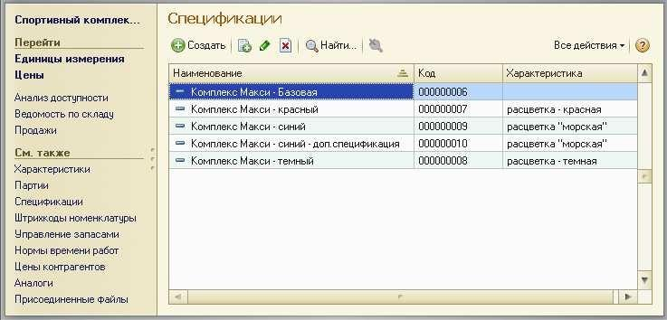
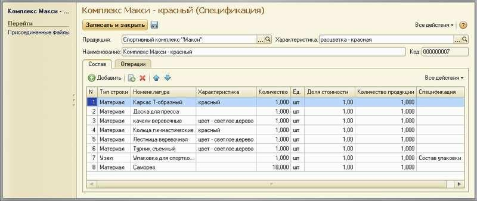
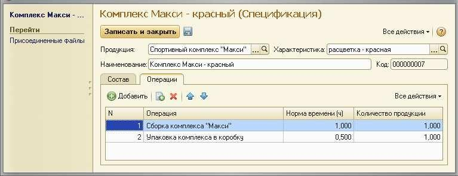
.. |image4| image:: static/images/2/image33.jpg
.. |image5| image:: static/images/2/image41.jpg
.. |image6| image:: static/images/2/image42.jpg
.. |image7| image:: static/images/2/image43.png
.. |image8| image:: static/images/2/image44.jpg

.. |image10| image:: static/images/2/image02.png
.. |image11| image:: static/images/2/image03.png
.. |image12| image:: static/images/2/image04.jpg
.. |image13| image:: static/images/2/image05.jpg
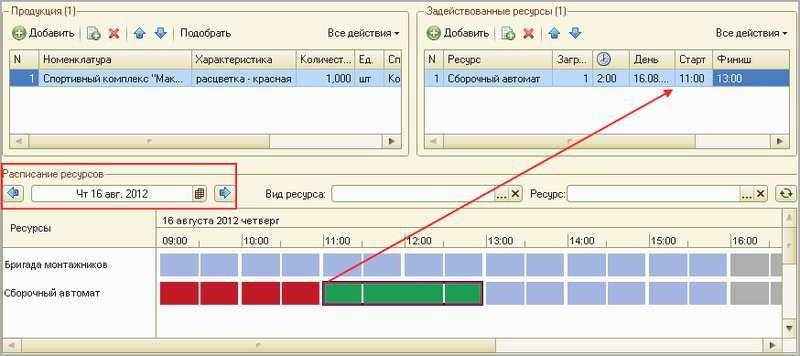
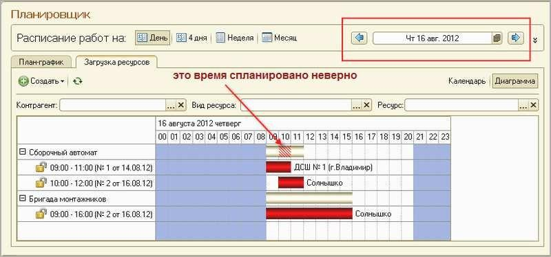
.. |image16| image:: static/images/2/image08.jpg
.. |image17| image:: static/images/2/image09.jpg
.. |image18| image:: static/images/2/image10.png
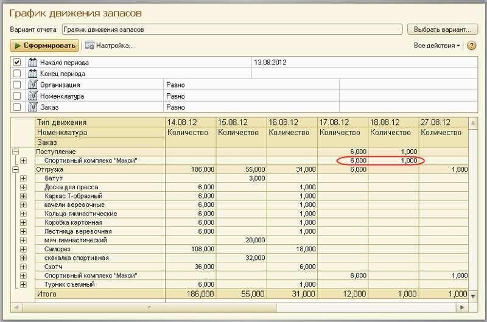
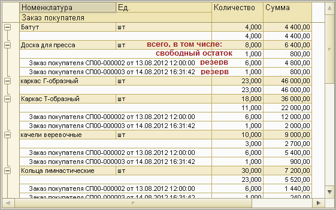
.. |image21| image:: static/images/2/image14.png
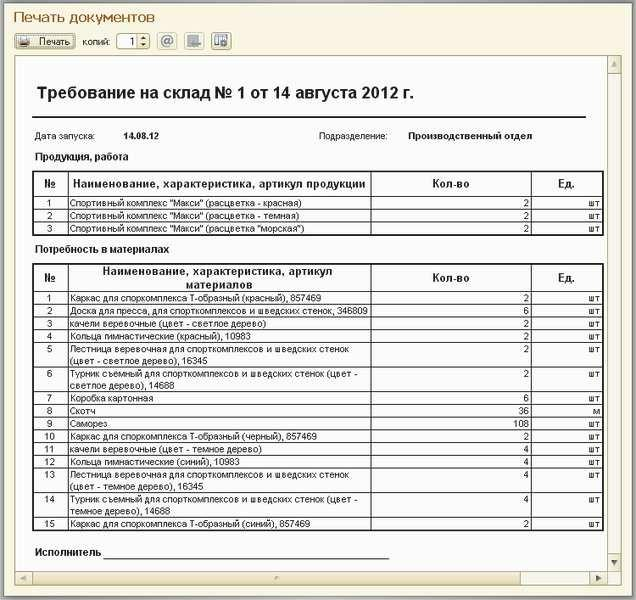
.. |image23| image:: static/images/2/image16.jpg
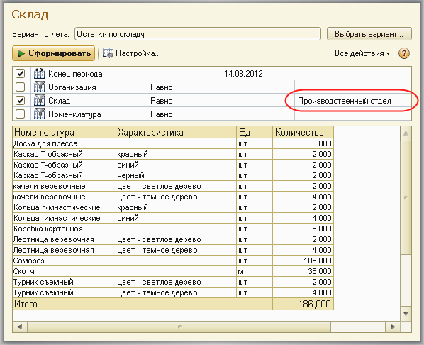
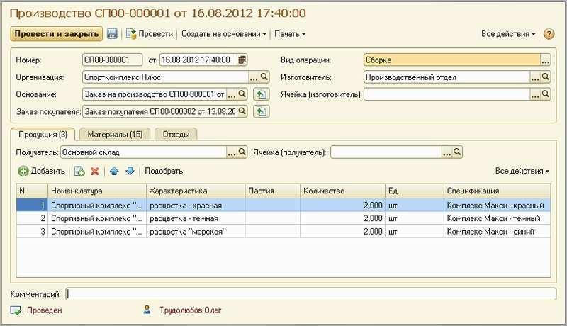
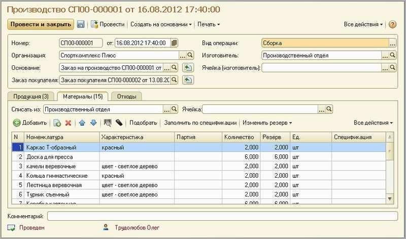
.. |image27| image:: static/images/2/image20.jpg
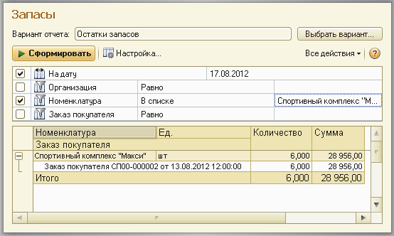
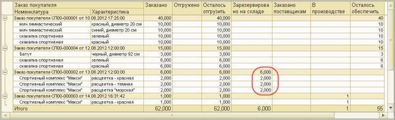
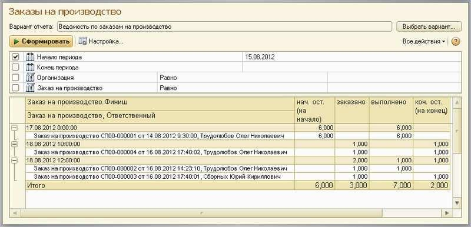
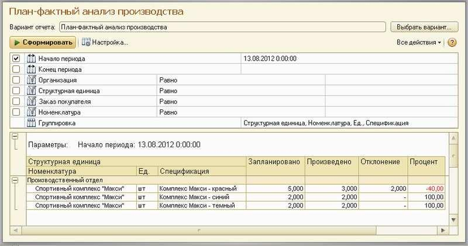
.. |image32| image:: static/images/2/image26.jpg
.. |image33| image:: static/images/2/image27.jpg
.. |image34| image:: static/images/2/image28.jpg
.. |image35| image:: static/images/2/image29.png
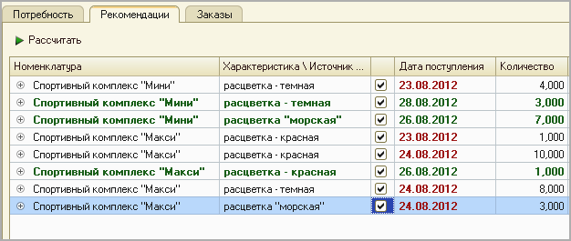
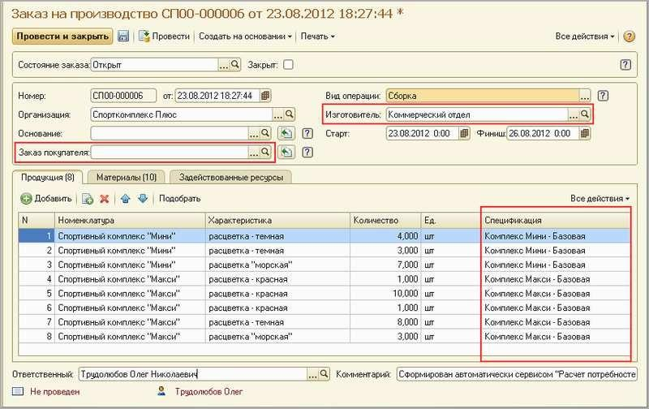
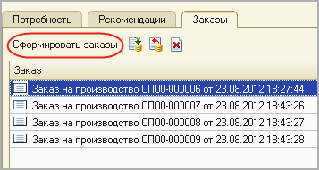
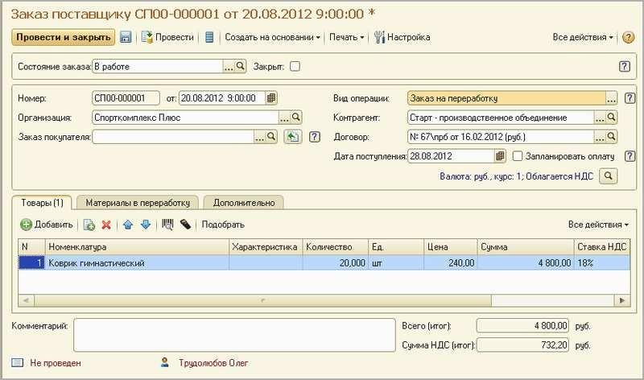
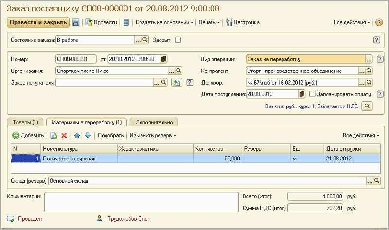
.. |image41| image:: static/images/2/image36.jpg
.. |image42| image:: static/images/2/image37.jpg
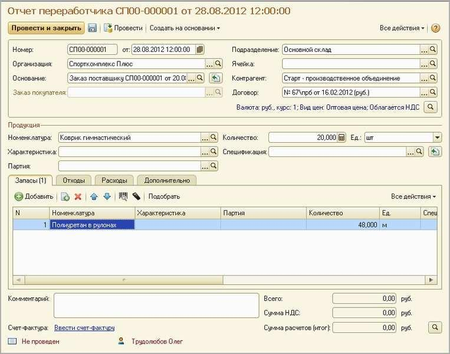
.. |image44| image:: static/images/2/image39.jpg
.. |image45| image:: static/images/2/image40.jpg
