Управление персоналом
=====================

Учет сведений о сотрудниках предприятия
---------------------------------------

Сведения о сотрудниках находятся в справочнике Сотрудники, доступ к
которому осуществляется по одноименной ссылке на панели навигации
раздела Зарплата. Форма карточки сотрудника приведена на рисунке 9.1.

|image0|

Рисунок 9.1. Карточка сотрудника

В реквизите Наименование указывается ФИО сотрудника (полностью или
сокращенно), далее выбирается Тип занятости. Здесь надо добавить, что
выбор типа занятости возможен только в том случае, если в настройках
параметров учета Зарплата установлен флажок Использовать
совместительство нескольких должностей одним физ.лицом. В случае, если
флажок не установлен (совместительство не используется) то все
сотрудники считаются работающими по основному месту работы. Для доступа
к настройкам параметров учета Зарплата зайдите в раздел Предприятие,
выберите Настройки на панели навигации, далее – Зарплата.

В группе реквизитов Счета учета расчетов  (открывается по ссылке
Редактировать счета учета) необходимо выбрать счета из плана счетов
управленческого учета. При вводе нового сотрудника эти реквизиты
программа заполняет сама, и если в план счетов не вносились изменения,
касающиеся расчетов с персоналом, то можно согласиться с предложенными
программой значениями счетов. Далее обратим внимание на реквизит
Физ.лицо:. Его значение выбирается из справочника Физические лица. См.
рисунок 9.2. Именно в справочнике  Физические лица хранится контактная
информация сотрудника (адреса, телефоны), его паспортные данные и ФИО.

Интересно, что если сотрудник совмещает несколько должностей, то он
должен быть введен в справочник

Сотрудники несколько раз. Но физ. лицо сотрудника будет во всех случаях
одно и то же.

|image1|

Рисунок 9.2. Карточка сотрудника и карточка физического лица

Напомним, что справочник Физические лица носит в программе универсальный
характер и может содержать не только записи о сотрудниках, но и,
например, о контрагентах, являющихся физическими лицами.

Должность сотрудника, график его работы, количество ставок, система
оплаты труда и подразделение, в  котором трудится сотрудник,
определяются при приеме его на работу (документ Прием на работу). В
случае, если перечисленные параметры работы сотрудника меняются, то это
необходимо отразить в программе с помощью документа Кадровое
перемещение. Для оформления увольнения сотрудника предназначен документ
Увольнение. Все эти документы вы найдете на панели навигации раздела
Зарплата.

Для удобства ввода данных в справочник Сотрудники при вводе каждого
нового сотрудника программа предоставляет возможность выбора – см.
рисунок 9.3.

|image2|

Рисунок 9.3. Выбор способа ввода данных о новом сотруднике

Вариант «Создать нового сотрудника и внести его личные данные в
справочник физических лиц» предполагает, что помимо записи в самом
справочнике Сотрудники, программа создаст еще и запись в справочнике
Физические лица. Этот вариант удобно применять в случаях, когда в
программе еще не содержится никакой информации о сотруднике.

Вариант «Создать нового сотрудника, выбрав его из справочника физических
лиц» может использоваться в тех случаях, когда личные данные
принимаемого на работу человека уже содержатся в справочнике Физические
лица. В этом случае будет создана только новая запись в справочнике
Сотрудники.

Выбрав третий вариант – «Создать нового сотрудника», мы получим только
новую запись в справочнике Сотрудники, а также (при условии, что в форме
заполнены все реквизиты, подчеркнутые красным) – новый документ Прием на
работу. Этот вариант удобен для быстрого оформления приема на работу
нового сотрудника без заполнения личных данных. Личные данные нового
сотрудника можно будет довести позже, создав для него новую запись в
справочнике Физические лица. В созданный программой документ Прием на
работу также могут быть затем внесены изменения, если это требуется.

На рисунке 9.4 приведена форма документа Прием на работу. В верхней
табличной части документа перечисляются принимаемые на работу сотрудники
и параметры их работы (дата приема на работу, подразделение, должность,
количество ставок, график работы), в нижней части – перечень основных
видов начислений и удержаний для каждого сотрудника из верхней табличной
части.

|image3|

Рисунок 9.4. Прием на работу

Табличная часть Налоги на доходы (расположена внизу справа – см. рисунок
9.4) доступна только в том случае, если в настройках параметров учета
(раздел Предприятие, далее – Настройки / Зарплата) установлен флажок
Вести учет налога на доходы. Сам налог на доходы должен быть при этом
введен в справочник Виды начислений и удержаний (см. рисунок 9.5).

|image4|

Рисунок 9.5. Налог на доходы в справочнике

«Виды начислений и удержаний»

Работу с начислениями и удержаниями мы еще рассмотрим позже.

При приеме на работу программа проводит проверку наличия вакантных
ставок по той должности и подразделению, куда принимается сотрудник, на
основании данных, внесенных в штатное расписание (см. рисунки 9.6 и
9.7).

Доступ к штатному расписанию для просмотра и изменения данных
осуществляется по ссылке Штатное расписание на панели навигации раздела
Зарплата (рисунок 9.6).

|image5|

Рисунок 9.6. Штатное расписание

Информацию о занятых и свободных ставках можно увидеть в отчете Штатное
расписание (рисунок 9.7), расположенном в группе отчетов по зарплате и
персоналу.

|image6|

Рисунок 9.7. Информация о занятых и вакантных ставках

в отчете «Штатное расписание»

Подчеркнем, что речь здесь идет о штатном расписании для целей
управленческого учета.

Учет заданий, выданных сотрудникам. Контроль исполнения заданий
---------------------------------------------------------------

Программа позволяет учитывать факт выдачи сотруднику задания и
контролировать его исполнение.

Для отражения факта выдачи сотруднику задания используется документ
Задание на работу. Мы уже обращались к этому документу в предыдущих
главах книги. В частности, с помощью него планировали предпродажную
работу с покупателями (в главе об управлении продажами) и выполнение
работ по заказ- нарядам (в главе о работах и услугах).

Список документов Задание на работу, начиная с ред. 1.4 программы,
доступен на панели навигации разделов Производство и Сервис (см. рисунок
9.8). Если вы не обнаружили их там, отредактируйте состав панели
навигации с помощью правой кнопки мыши[8] (рисунок 9.9).

|image7|

Рисунок 9.8. Список заданий на работу можно открыть, находясь в разделе
«Производство»

|image8|

Рисунок 9.9. Настройка панели навигации вызывается щелчком правой кнопки
мыши на панели навигации

Задания могут быть внешние и внутренние (определяется значением
реквизита Вид операции – см. рисунок 9.8). Внешние задания связаны с
выполнением платных работ для заказчика. В этом случае документ Задание
на работу может быть введен, например, на основании документа
Заказ-наряд. Внутренние задания – это поручения сотрудникам в интересах
текущей деятельности фирмы. Например, с помощью документа Задание на
работу руководитель отдела может учитывать задачи, поставленные
подчиненным, с тем, чтобы не забыть о них (задачах) и проконтролировать
исполнение. Пример такого документа Задание на работу приведен на
рисунке 9.10. В этом примере руководитель фирмы Семенов Александр
поручил сотруднику Бегуновой Анне подготовить материалы для выставки к
18 часам 30 августа.

|image9|

Рисунок 9.10. Использование документа «Задание на работу» для выдачи
поручения сотруднику

Плановую длительность работы (реквизиты Длительность) указывать не
обязательно – программа допускает ввод документов Задание на работу с
нулевой длительностью. Задания с нулевой длительностью – это задачи
сотрудникам, сформулированные как «сделать что-то к такому-то сроку».
При этом не формулируется конкретно, сколько времени предполагается на
это задание потратить и в какие дни. Пример задания с нулевой
длительностью показан на рисунке 9.11.

|image10|

Рисунок 9.11. Пример задания с нулевой длительностью

Как нам уже известно, из предыдущих глав, задания на работу отражаются в
календаре сотрудника. См. рисунок

9.12. Это помогает каждому сотруднику держать перед глазами список
заданий, которые он получил от руководителя, со сроками выполнения. Что
в свою очередь, способствует тому, чтобы каждый сотрудник мог

правильно организовать свою деятельность в интересах фирмы.

|image11|

Рисунок 9.12. Отображение заданий в календаре сотрудника – исполнителя
заданий

Обратите внимание, что задание с нулевой длительностью «составить проект
прайс-листа к 10:00 30 августа» отображается в календаре (рисунок 9.12)
без указания времени его выполнения: клеточки таблицы по нему не
закрашены, указан только срок – До 10:00. А у другого задания Бегуновой
на этот день отмечено еще и плановое время его исполнения – с 17 до 18
часов, предполагаемая длительность работы над этим заданием составляет 1
час.

Независимо от того, является ли задание внешним или внутренним, его
исполнение может быть оплачено сотруднику. Конечно, если это
предполагается схемой его финансовой мотивации. Для этого у сотрудника в
программе должен быть предусмотрен соответствующий вид начисления.
Пример этого можно видеть на рисунке 9.4: для сотрудника Гайкина
установлен вид начисления «Оплата по заданиям» с тарифной ставкой 100
рублей за 1 час работы. Разумеется, оплата будет идти за фактически
отработанное время по заданиям.

После того, как сотрудник выполнил задание, а руководитель (или другое
лицо, поручившее выполнение задания), принял его, можно отразить в
программе факт исполнения.

Для этой цели задание переводится в состояние Завершено. Не обязательно
такое состояние должно быть сформулировано именно как «Завершено». Ведь
перечень состояний заданий формируется вами самостоятельно. Однако
изначально в этом списке содержатся три предопределенных элемента,
удалить которые нельзя (см. рисунок 9.13).

|image12|

Рисунок 9.13. Состояния событий и заданий

Но вы можете поменять их формулировки, например, вот так – рисунок 9.14.
Или каким-либо иным образом, отражающим специфику работы вашей компании.
Не забывайте только о том, что данный список используется как для
документов Задание на работу, так и для документов Событие[9].

|image13|

Рисунок 9.14. Пример изменения списка состояний и событий

В примере на рисунке 9.14 мы изменили формулировку пункта «Завершено» на
«3 Принято руководителем (закрыто)», добавили новый пункт «2 Выполнено
сотрудником (завершено)» и внесли небольшие изменения в

«запланировано» и «отменено». Таким образом, в нашем примере задание
будет считаться полностью завершенным только тогда, когда оно находится
в состоянии «3 Принято руководителем (закрыто)». Именно этот элемент
списка и соответствует выполненному заданию.

Для анализа выполнения заданий и контроля загруженности персонала
руководитель фирмы может использовать форму Календарь сотрудника. В этой
форме можно одновременно представить данные по нескольким сотрудникам.
Для этого, надо нажать кнопку Список сотрудников и включить в список
всех сотрудников, чьи данные необходимо проверить. См. рисунок 9.15.

|image14|

Рисунок 9.15. Выбор списка сотрудник в форме

«Календарь сотрудника»

Представленная в Календаре сотрудника информация поможет руководителю
небольшой фирмы не только посмотреть выполненные и невыполненные
задания, но и контролировать ситуацию по сотрудникам в целом – кто и чем
занимается, а также выявлять ситуации неравномерной загрузки персонала.
Данные по каждому сотруднику представлены в виде, показанном на рисунке
9.12: для каждого сотрудника перечислены его задания и события со
сроками выполнения.

Напомним, что доступ к Календарю сотрудника осуществляется по ссылке Мой
календарь на рабочем столе

– рисунок 9.16.

|image15|

Рисунок 9.16. Ссылка «Мой календарь» для доступа к календарям
сотрудников

Для контроля исполнения заданий можно (и нужно) использовать не только
форму Календарь сотрудника. Список заданий представлен также и на
Рабочем столе на панели заданий. Нажав кнопку Я – автор или Я –
исполнитель, вы увидите задания, выданные вами, либо – выданные вам,
соответственно. См. рисунок 9.17.

|image16|

Рисунок 9.17. Панель заданий, я – автор

Выполненные задания «уходят» с панели заданий. Таким образом, например,
руководитель небольшой фирмы всегда имеет под рукой список заданий,
которые еще не выполнены его подчиненными.

Альтернативным вариантом просмотра списка всех неисполненных заданий
является отбор в списке документов

Задание на работу (отбор устанавливаем по значению реквизита Состояние).

Для проведения анализа исполнения заданий сотрудниками можно также
использовать и отчет Задания на работу. Отчет располагается в разделах
Зарплата и Сервис. Пример отчета показан на рисунке 9.18.

|image17|

Рисунок 9.18. Анализ времени, затраченного на выполнение заданий с
помощью отчета «Задания на работу»

В показанном на рисунке 9.18 примере видно, что сотрудник Бегунова еще
не предоставила рекламные материалы, Гайкин до сих пор не подготовил
предварительное решение по монтажу комплекса, а Перевозчиков выполнил
платные работы по установке и монтажу, превысив на 1 час нормативное
время. Показатели графы Загрузка приводятся в отчете в часах. Для
внешних заданий присутствуют данные в графе Сумма, для внутренних –
графа Сумма пуста.

Надо сказать, что в отчет Задания на работу не включаются задания с
нулевой длительностью. И это вполне объяснимо, ведь основной смысл
отчета – план-фактный анализ времени, затрачиваемого на исполнение
заданий. Имея под рукой такой отчет, руководитель фирмы может увидеть,
что именно «съедает» рабочее время

его сотрудников, на какие работы пора пересмотреть нормативы, кто из
сотрудников регулярно перерабатывает, а кому из заказчиков недовыставили
счетов на платные работы.

Фактическое время, затраченное на выполнение заданий, попадает в отчет
Задания на работу, исходя из введенных в программу документов Учет
времени. Этот документ рассмотрен ниже в параграфе «Учет рабочего
времени».

Учет рабочего времени
---------------------

Отработанное сотрудниками время регистрируется в программе с помощью
документов Учет времени и

Табель.

Документ «Учет времени»
-

Документом Учет времени (рисунок 9.19) учитывается время, затраченное на
исполнение заданий.

|image18|

Рисунок 9.19. Учет фактического времени по заданиям

Документ вводится отдельно на каждого сотрудника и охватывает период
времени, равный одной неделе. С помощью кнопки Заполнить по плану
табличную часть можно заполнить информацией из введенных ранее
документов Задание на работу, а далее – просто откорректировать по
факту. Количество часов, указанное в табличной части, учитывается для
сотрудника как время, затраченное на выполнение работ по заданиям.

Документ Учет времени может быть введен на основании документа Задание
на работу. В этом случае в табличной части документа Учет времени будет
автоматически заполнена одна строка табличной части – в соответствии с
данными, имеющимися в задании на работу.

Документ Учет времени не заменяет по смыслу табель учета рабочего
времени. Время, отмеченное в документе Учет времени как отработанное по
заданиям, не появляется автоматически в табеле как отработанное
сотрудником.

Документ «Табель»
-

Теперь перейдем к документу Табель (рисунок 9.20). Документ предназначен
для ввода данных об использовании рабочего времени сотрудниками того или
иного подразделения за определенный календарный период (месяц).

|image19|

Рисунок 9.20. Табель учета рабочего времени

Данные в табеле могут регистрироваться сводно за период (при этом для
одного сотрудника можно указывать до шести видов использованного
времени), либо по дням.

По кнопке Заполнить табличная часть заполняется списком сотрудников
выбранного подразделения с отработанным количеством дней и часов
согласно производственному календарю. Календарь необходимо заполнить до
начала работы с данными раздела Зарплата (как это сделать, описано в
главе «Ввод начальных данных»). Если у сотрудников были отклонения от
производственного календаря, необходимо их указать. В примере на рисунке
9.20 сотрудники Выгоднов и Перевозчиков отработали меньше, чем полный
месяц.

В одном документе Табель присутствуют данные только по одному
структурному подразделению фирмы. Поэтому, если ваша фирма состоит их
нескольких подразделений, необходимо несколько документов за один и тот
же месяц. Список документов Табель доступен на панели навигации раздела
Зарплата.

На основании данных, введенных в документы Табель, можно провести анализ
отработанного времени – в целом или по видам использования времени, по
подразделениям и сотрудникам, с помощью специальных отчетов Отработанное
 время  в  целом  за  период  и Отработанное  время  по  дням. На
рисунке 9.21 показан пример – отчет Отработанное время в целом за
период, с отбором по виду «явка». В таком виде отчет показывает, сколько
дней и часов фактически отработали сотрудники за прошедший месяц.

|image20|

Рисунок 9.21. Отчет «Отработанное время в целом за период» с отбором по
виду «Я» (явка) показывает фактически отработанное сотрудниками время

Данные о фактически отработанном сотрудниками времени используются для
расчета заработной платы при повременной оплате труда.

Здесь имеет смысл напомнить, что программа «1С:Управление небольшой
фирмой 8» предназначена для ведения управленческого, а не бухгалтерского
учета. Поэтому с помощью документа Табель необходимо отражать фактически
отработанные сотрудниками дни и часы. В случае, когда, например,
сотрудник ходил на работу и исполнял свои трудовые обязанности,
формально по документам находясь на больничном листе, это время должно
учитываться как отработанное. В этом случае программа начислит
сотруднику за эти дни зарплату, а не больничный.

Повременная и сдельная оплата труда. Начисление зарплаты
--------------------------------------------------------

С помощью программы «1С:Управление небольшой фирмой 8» можно
автоматизировать начисление заработной платы в управленческом учете как
при повременной, так и при сдельной системе оплаты труда.

Общий перечень видов используемых начислений и удержаний доступен для
редактирования по ссылке Виды начисления и удержаний на панели навигации
раздела Зарплата. Надо отметить, что при первом запуске программы этот
список заполняется автоматически несколькими видами начислений – см.
рисунок 9.22.

Остальные виды, которые используются в управленческом расчете заработной
платы, необходимо ввести в этот список, и в этой главе мы рассмотрим,
как это сделать.

|image21|

Рисунок 9.22. Виды начислений и удержаний

Итак, с помощью каких средств программы выполняется начисление
заработной платы сотрудникам?

Сдельная оплата труда
-

Начнем со сдельной оплаты труда. В списке видов начислений и удержаний
присутствуют два предопределенных вида – «Сдельная оплата (% от суммы)»
и «Сдельная оплата (тариф)» (см. рисунок 9.22).

Начисление сдельной зарплаты в программе выполняется документами
Сдельный наряд и Заказ-наряд.

Документ Сдельный наряд начисляет заработную плату по виду начисления
«Сдельная оплата (тариф)». При этом размер тарифа определяется на
вкладке Операции, исходя из перечня технологических операций,
выполненных сотрудником (сотрудниками) и их стоимости. См. рисунок 9.23.

|image22|

Рисунок 9.23. Сумма начислений сотрудникам по сдельному тарифу
определяется стоимостью работ в документе

«Сдельный наряд»

Кому начислить эту сумму – определяется значением реквизита Исполнитель.
При этом если исполнителей несколько (бригада), состав бригады
указывается на вкладке Состав бригады. См. рисунок 9.24.

|image23|

Рисунок 9.24. Состав бригады и коэффициент трудового участия каждого
работника в документе «Сдельный наряд»

Размер начисления каждому из сотрудников зависит от значения КТУ
(коэффициента трудового участия) сотрудника. При равной степени участия
(например, у каждого из сотрудников КТУ - 1), всем сотрудникам бригады
будет начислена одинаковая сумма. В нашем примере (рисунки 9.23 – 9.24)
общая сумма по наряду 4 200 рублей будет делиться между Гайкиным и
Молотковым в пропорции 1: 0,8.

Начисление зарплаты по сдельному наряду программа выполняет только при
установленном флажке Закрыт и проводит его на дату, указанную в
реквизите Дата закрытия.

Сдельная заработная плата начисляется также и документом Заказ наряд
(рисунок 9.25).

|image24|

Рисунок 9.25. Выбор вида начисления в документе «Заказ-наряд»

При этом могут быть использованы оба вида начисления – «Сдельная оплата
(% от суммы)» или «Сдельная оплата (тариф)». В графе Размер необходимо
указать процент (при оплате процентом) или тариф (при оплате по тарифу).
Аналогично сдельному наряду в заказ-наряде указывается КТУ для каждого
из исполнителей.

Более подробно вопрос начисления зарплаты в заказ-наряде рассмотрен при
описании документа Заказ-наряд

в главе «Выполнение работ, оказание услуг».

Таким образом, для начисления сдельной заработной платы в программе
«1С:Управление небольшой фирмой 8» применяются  документы  Сдельный
 наряд  и  Заказ-наряд.

Повременная оплата труда

Повременная заработная плата начисляется в программе документом
Начисление зарплаты, который находится в разделе Зарплата.

|image25|

Рисунок 9.26. Начисление повременной оплаты труда с помощью документа
«Начисление зарплаты»

Порядок работы с этим документом следующий.

#. Заполнить реквизиты шапки документа.

2. Нажать на кнопку Заполнить. При этом в табличной части появится
   список сотрудников, их плановых начислений/ удержаний, а также
   перечень показателей (Показатель 1, Показатель 2, Показатель 3), на
   основании значений которых будет рассчитана сумма
   начисления/удержания, и сами значения этих показателей.

3. Ввести значения показателей в том случае, если показатель
   предполагает ручной ввод значения.

4. Нажать на кнопку Рассчитать.

5. При необходимости – провести ручную корректировку результатов
   расчетов.

6. Проверить значения реквизитов, определяющих способ отнесения суммы на
   затраты (Счет затрат, Направление деятельности, Заказ покупателя),
   автоматически заполненные программой.

7. В случае, если ведется учет налога на доходы, то перейти на вкладку
   Налоги на доходы и ввести суммы налога.

Проанализировать данные о начисленной зарплате по сотрудникам,
подразделениям, видам начислений (удержаний) можно с помощью отчета
Начисления и удержания. Пример отчета представлен на рисунке 9.27.

|image26|

Рисунок 9.27. Пример отчета «Начисления и удержания»

Также в разделе Зарплата можно сформировать расчетные листки, расчетную
ведомость, и другие отчеты.

В заключение добавим, что расчет сумм начислений и удержаний по
сотруднику возможен только по тем видам начислений и удержаний, которые
определены для данного конкретного сотрудника. Список плановых видов
начислений и удержаний сотрудника определяется в документе Прием на
работу или, если были изменения в системе оплаты труда – в документе
Кадровое перемещение. А посмотреть список плановых видов начислений и
удержаний можно и непосредственно из карточки сотрудника (рисунок 9.1).

Выплата зарплаты
----------------

Выплата зарплаты (аванса) возможна двумя способами – по платежной
ведомости, формируемой в целом на структурное подразделение, или по
документу расхода из кассы для отдельного сотрудника.

|image27|

Рисунок 9.28. Платежная ведомость

Сформированная платежная ведомость может являться основанием для
документов движения денежных средств. В частности, на основании этого
документа могут быть созданы документы Заявка на расход денег, Расход из
кассы  и  Расход  со  счета.

Документы Платежная ведомость находится в разделе Зарплата.

Если вы выдаете зарплату не по ведомостям на подразделение, а каждому
сотруднику индивидуально (что встречается на практике гораздо чаще),
необходимо на каждую выдачу оформить документ расхода денежных средств.
Пример показан на рисунке 9.29.

|image28|

Рисунок 9.29. Выплата зарплаты сотруднику из кассы

Обратите внимание, что в этом случае Вид операции выбирается как
Зарплата сотруднику, а не Зарплата по   ведомости.

Управление финансовой мотивацией персонала. Оплата за результат
---------------------------------------------------------------

Мотивация – это побуждение сотрудников к достижению целей компании при
соблюдении своих интересов. Подкрепить мотивацию сотрудников на
достижение нужных для предприятия результатов можно путем увязывания
этих результатов с размером денежного вознаграждения сотрудника. Такую
методику называют системой мотивации по KPI (Key Performance Indicator).
Существует много вариантов перевода термина KPI на русский язык.
Пожалуй, наиболее точным из них, применительно к работе сотрудника,
можно считать вариант

«Ключевой показатель производительности труда». Состав KPI определяется
индивидуально для каждой должности. Для сейлз-менеджеров это могут быть
показатели объема продаж, для производственников – качество выпущенной
продукции, соблюдение бюджета производственных расходов, для снабженцев
– соблюдение графика поставок, и так далее. К разработке состава KPI и
методов их измерения необходимо подходить очень ответственно. В
настоящее время существуют специальные технологии, помогающие
разработать правильную систему KPI. Здесь мы не ставим своей задачей
рассмотреть эти технологии.

Обычно схема финансовой мотивации сотрудника с учетом KPI строится
следующим образом: присутствует некая постоянная часть оплаты труда
(оклад), не зависящая от достигнутых сотрудником результатов, а в
дополнение к постоянной части определяется переменная часть, которая и
зависит от значений KPI сотрудника. Количество KPI для одного сотрудника
(одной должности) обычно составляет от 3 до 7, при этом у каждого
показателя может быть свой вес (значимость).

Реализовать привязку переменной части оплаты труда к результатам работы
сотрудника в программе

«1С:Управление небольшой фирмой 8» можно с помощью средств раздела
Зарплата.

Как это сделать? Рассмотрим конкретный пример. Одним из показателей
работы сейлз-менеджера является объем продаж (типичный пример, не правда
ли?). Введем для сотрудников коммерческого отдела новый вид начислений
«Бонус за продажи», определяемый как 5% от объема личных продаж.

Шаг 1. Добавляем новый параметр расчетов «Объем продаж менеджера» в
справочник Параметры расчетов.

Рисунок 9.30.

|image29|

Рисунок 9.30. Список параметров расчетов

Шаг 2. Определяем для параметра расчетов «Объем продаж менеджера»
правила выборки данных. Данные  будут выбираться из регистра накопления
Продажи, брать будем объем продаж не в количественном, а в стоимостном
выражении (Источник.Сумма), при этом критерием отнесения продажи к
конкретному сейлз- менеджеру будет указание его в качестве
ответственного в заказе покупателя. См. рисунок 9.31 (Вы, конечно, у
себя можете выбрать и другой критерий – ответственный в накладной,
ответственный менеджер в карточке покупателя и т.д.).

|image30|

Рисунок 9.31. Параметр расчетов «Объем продаж менеджера»

Шаг 3. Переходим в справочник Виды начислений и удержаний, вводим новый
вид начислений «Бонус за продажу», определяем формулу его расчета (5% от
объема продаж) и счет отнесения затрат. Редактирование формулы расчета
показано на рисунке 9.32.

|image31|

Рисунок 9.32. Редактирование формулы расчета вида начисления / удержания

Шаг 4. Добавляем вид начисления «Бонус за продажи» в список плановых
начислений сейлз-менеджеров. Для этого вводим документ Кадровое
 перемещение  с видом операции Изменение  условий  оплаты.

Все, на этом подготовительные действия завершены, и можно посмотреть,
как будет выполняться проведение расчетов.

Вводим документ Начисление зарплаты, заполняем реквизиты шапки
(подразделение – коммерческий отдел) и нажимаем кнопку Заполнить.
Рисунок 9.33. Видим, что в табличной части появились строки с видом
начислений «Бонус за продажи», при этом произошел расчет значения
показателей «Объем продаж менеджера».

|image32|

Рисунок 9.33. Автозаполнение табличной части документа

«Начисление зарплаты» по сотрудникам коммерческого отдела

Теперь нажимаем кнопку Рассчитать и в графе Сумма видим результат
расчета. См. рисунок 9.34.

|image33|

Рисунок 9.34. Расчет суммы бонуса за продажу На этом расчет закончен.

Мы рассмотрели простой пример настройки зависимости заработной платы
сотрудника от результатов его работы, на основании значения ключевого
показателя «Объем продаж».

В случае, когда у сотрудника несколько ключевых показателей (а так оно и
должно быть), то можно учесть все показатели в формуле расчета вида
начисления, либо описать отдельный вид начисления для расчета по каждому
из показателей.

Еще один пример. Замотивируем начальников отделов продаж и снабжения от
валовой прибыли. Действительно

– первый отвечает за то, чтобы продать подороже, а второй – чтобы
закупить подешевле. При этом оба трудятся на общий результат – прибыль
компании. Поэтому добавить им плюсом к окладу процент с валовой прибыли
вполне разумно.

Валовая прибыль определяется как разница между суммой продаж и
себестоимостью продаж 9.35.\ |image34|

Рисунок 9.35. Отчет Валовая прибыль (с группировкой по ответственным
заказов покупателей и номенклатуре)

| 
| [1 0] 

| 

– см. рисунок

Вводим показатели СуммаПродаж и Себестоимость продаж в справочник
Параметры расчетов. См. рисунки 9.36 и 9.37.

|image35|

Рисунок 9.36. Параметр расчета «Сумма продаж»

|image36|

Рисунок 9.37. Параметр расчета «Себестоимость продаж»

Теперь введем новый вид начисления в справочник Виды начислений и
удержаний – см. рисунок 9.38. Формулу расчета определяем как 6% от
разницы между суммой продаж и себестоимостью продаж.

|image37|

Рисунок 9.38. Начисление «Проценты от валовой прибыли»

Теперь осталось лишь добавить вид расчета в список плановых начислений
начальников отделов и рассчитать зарплату. Так, как мы это делали в
предыдущем примере.

|image38|

Рисунок 9.39. Теперь начальник отдела снабжения получает 6% от валовой
прибыли плюсом к окладу

Вопросы для самоконтроля
------------------------

1. В чем разница между справочниками «Сотрудники» и «Физические лица»?

2. Где в программе вводятся данные о плановых начислениях сотрудника?
   Каким документом отражаются изменения в плановых начислениях
   сотрудника?

3. Для чего предназначен реквизит «Состояние» в документе «Задание на
   работу»?

4. Включаются ли в отчет «Задания на работу» задания с нулевой
   длительностью?

5. В чем отличие внутренних заданий от внешних?

6. Перечислите, какие данные можно видеть в форме «Календарь
   сотрудника». Как открыть эту форму?

7. Какие документы предназначены для начисления зарплаты при сдельной
   оплате труда? А при повременной?

8. Какие данные хранятся в справочнике «Параметры расчетов»?

9. Какие действия выполняются программой при нажатии на кнопку
«Заполнить» в документе «Начисление зарплаты»?

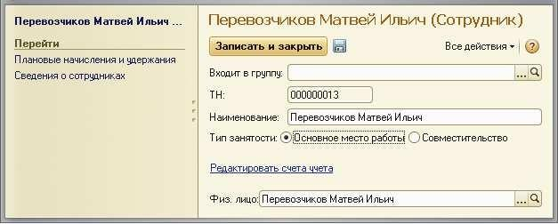
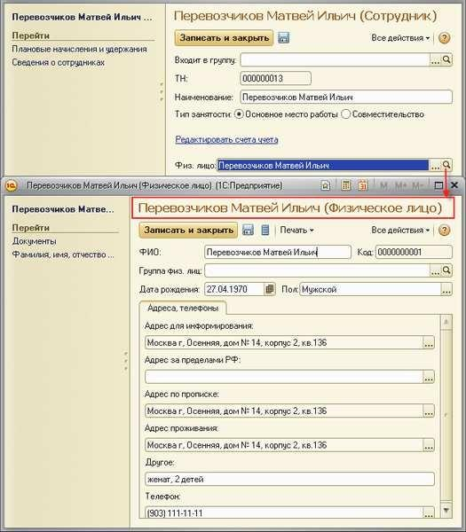
.. |image2| image:: static/images/6/image12.jpg
.. |image3| image:: static/images/6/image23.jpg
.. |image4| image:: static/images/6/image33.jpg
.. |image5| image:: static/images/6/image34.jpg
.. |image6| image:: static/images/6/image35.png
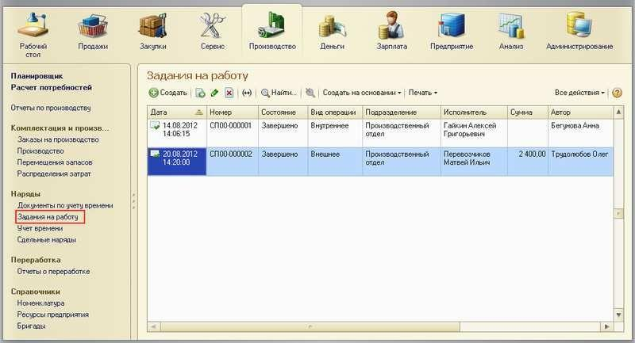
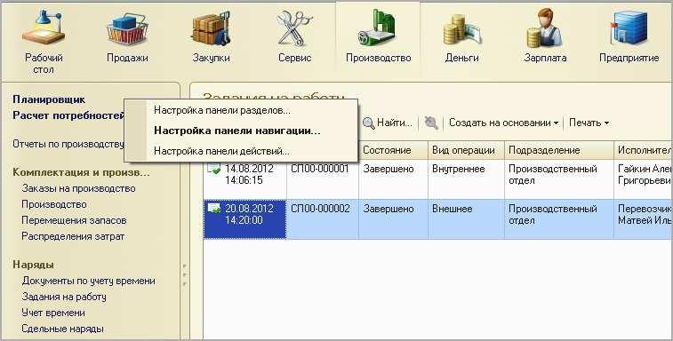
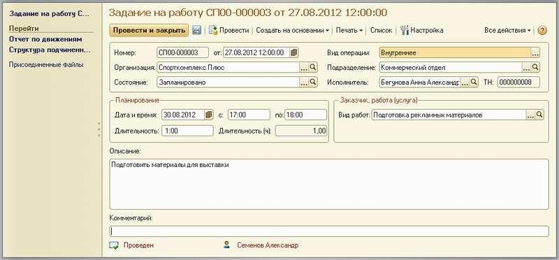
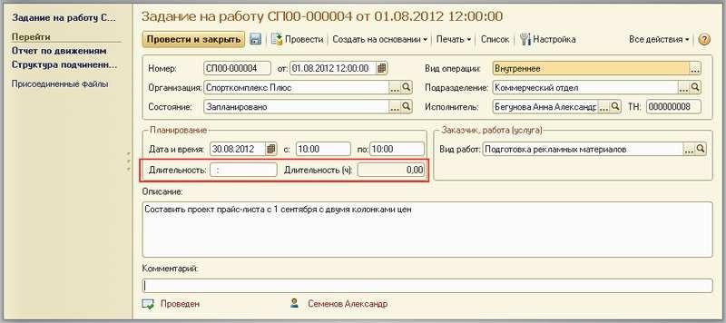
.. |image11| image:: static/images/6/image03.jpg
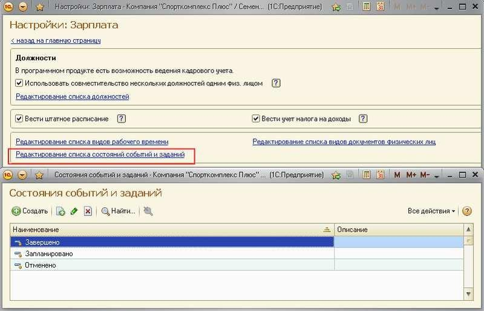
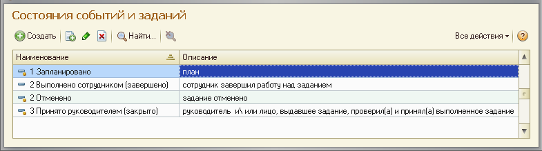
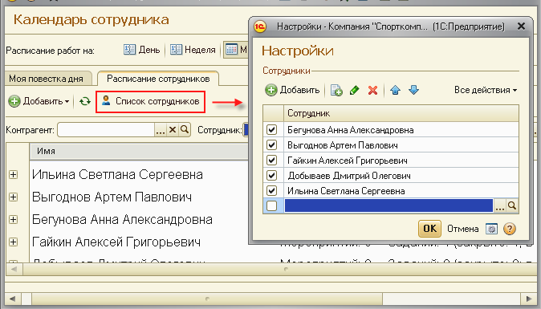
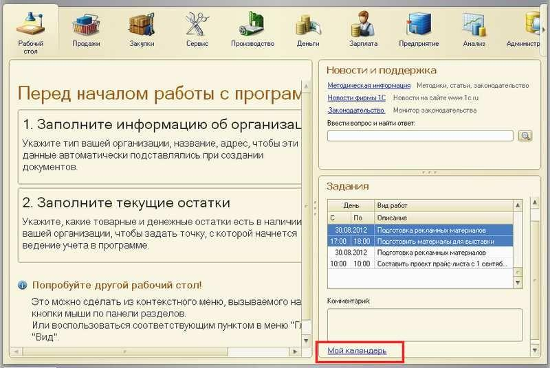
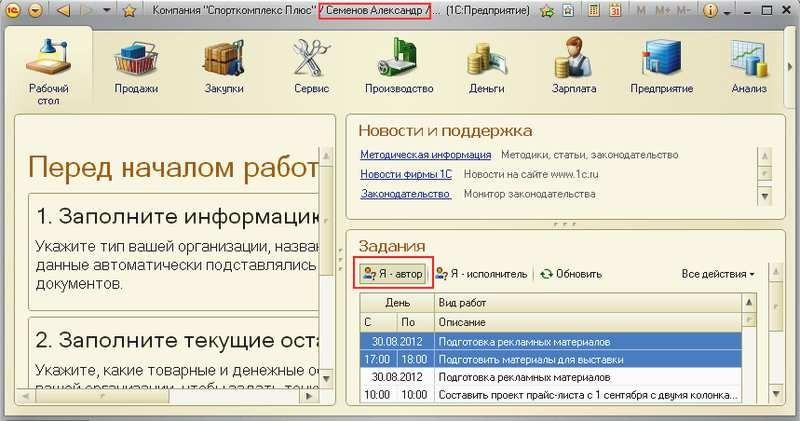
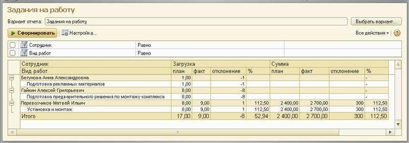
.. |image18| image:: static/images/6/image10.jpg
.. |image19| image:: static/images/6/image11.jpg
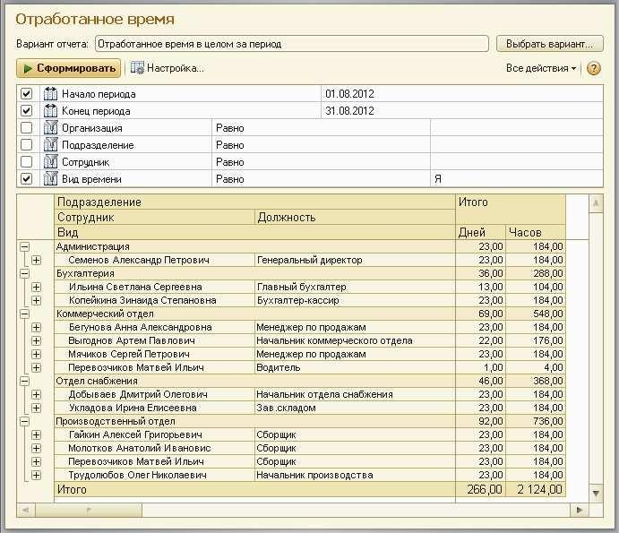
.. |image21| image:: static/images/6/image14.jpg
.. |image22| image:: static/images/6/image15.jpg
.. |image23| image:: static/images/6/image16.jpg
.. |image24| image:: static/images/6/image17.jpg
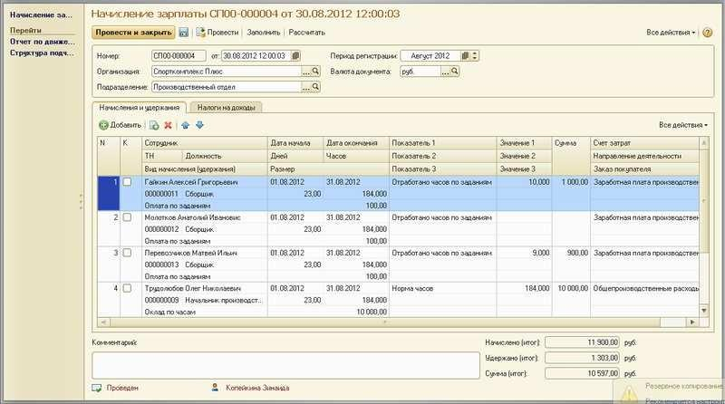
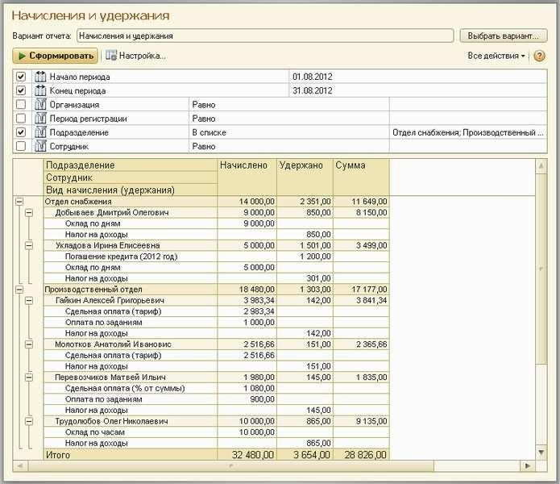
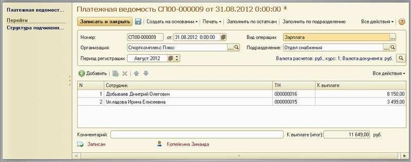
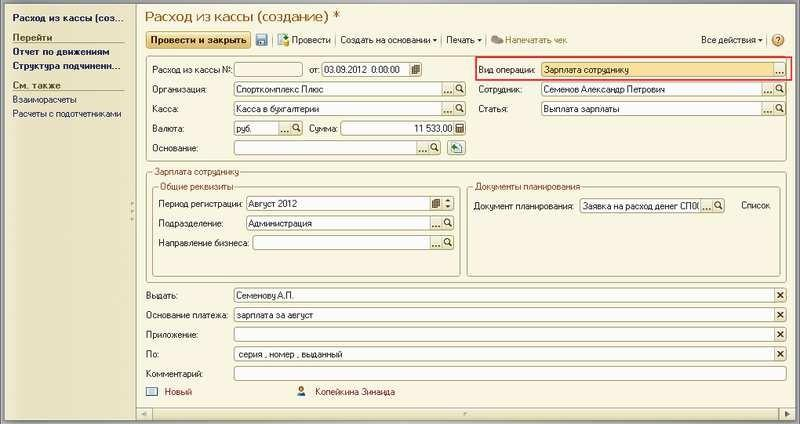
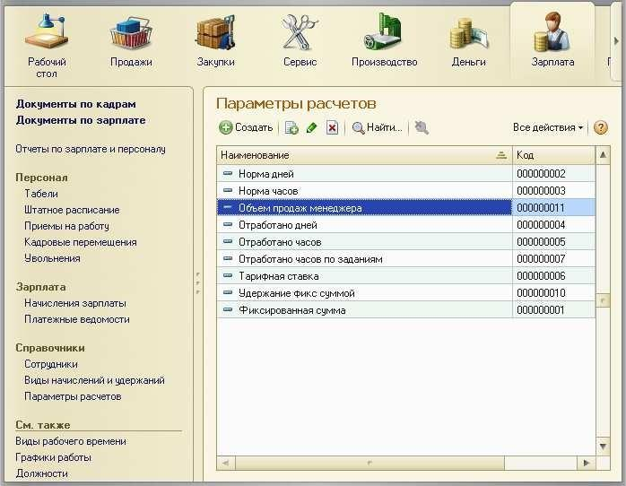
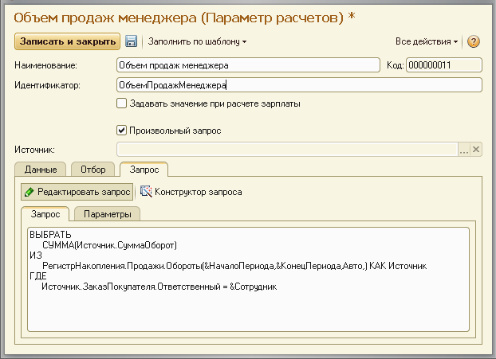
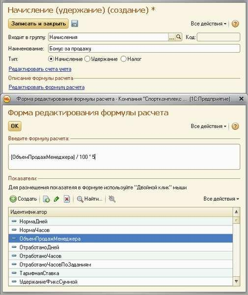
.. |image32| image:: static/images/6/image26.jpg
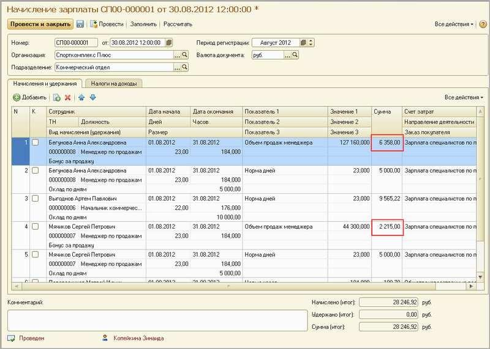
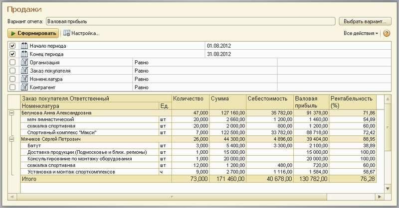
.. |image35| image:: static/images/6/image29.png
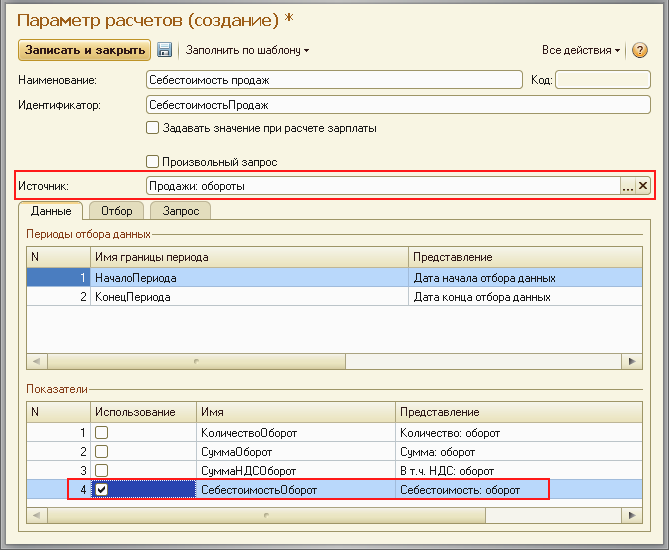
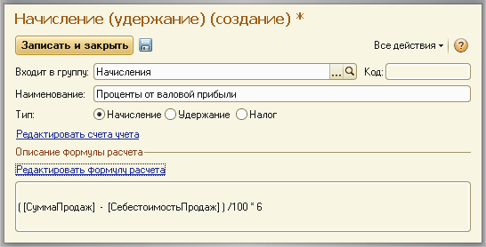
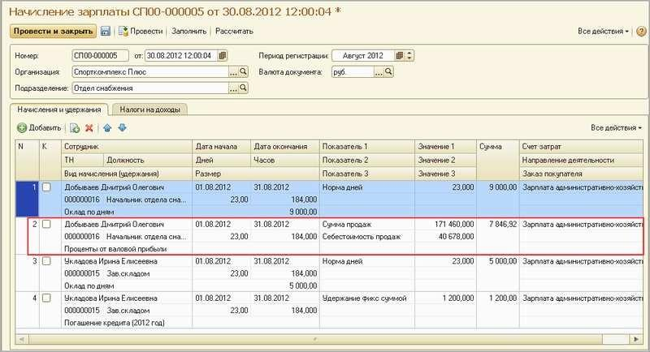
