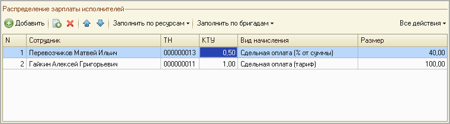
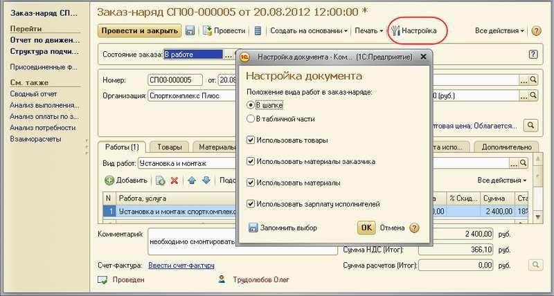
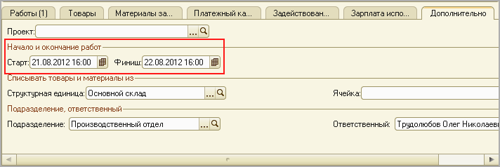
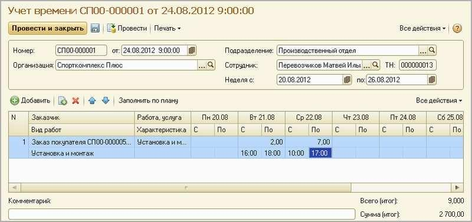
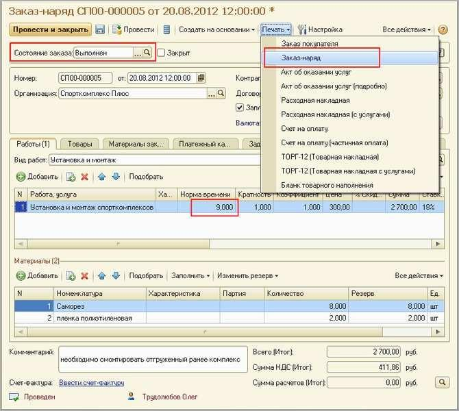
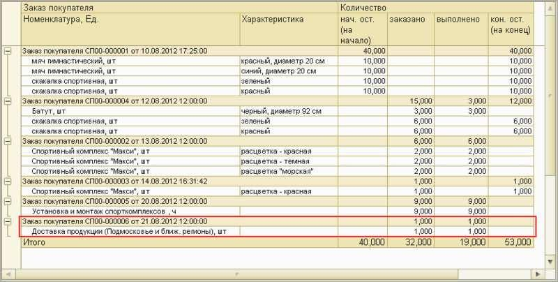

Выполнение работ, оказание услуг

В этой главе мы рассмотрим функциональные возможности программы для
планирования, учета, контроля и анализа деятельности, связанной с
выполнением работ и оказанием услуг. «Выполнение работ» и «оказание
услуг» – достаточно близкие по смыслу понятия. Разница в том, что работа
обычно имеет какой-либо материальный результат – построенный дом,
смонтированный и установленный спортивный комплекс. Услуга, как правило,
материального результата не имеет. Выполнение работ по смыслу ближе к
производственной деятельности, со всеми ее атрибутами – учетом
производственных затрат, расчетом себестоимости и т.д. Для услуг такое
не характерно.

Управление процессом выполнения работ
=====================================

Основным документом, отражающим деятельность по выполнению работ в
программе, является Заказ-наряд. Очень интересный, особенный, документ.
Уникальность документа Заказ-наряд состоит в том, что он фактически
выполняет функции нескольких документов – таких, как Заказ покупателя,
Расходная накладная, Акт выполненных работ. Кроме того, он еще может
начислить исполнителям работ заработную плату, т. е. выполняет еще и
функцию документа Начисление зарплаты.

Итак, рассмотрим возможности документа Заказ-наряд на конкретном примере
– будем в программе отражать всю цепочку действий, связанных с
выполнением работ для клиента (заказчика).

Цепочку начнем с регистрации потребности клиента. Потребность необходимо
оформить в заказ – что, для кого и в каком количестве мы будем делать.
Изучив предыдущие главы книги, мы уже знаем, что для оформления заказа
предназначен документ Заказ покупателя. Но в данном случае это не так.
Заказ покупателя создавать не нужно, вводим сразу Заказ-наряд. Документы
Заказ-наряд доступны по ссылке Заказ-наряды на панели навигации раздела
Сервис.

Заказ-наряд представлен на рисунке 6.1.

|image0|

Рисунок 6.1. Документ «Заказ-наряд», вкладка «Работы»

На рисунке 6.1 показан следующий пример заказ-наряда: наша организация
«Спорткомплекс Плюс» будет выполнять работы по установке и монтажу
спорткомплекса для заказчика «Солнышко», плановая трудоемкость работ
составляет 8 часов, стоимость каждого часа для заказчика составляет 300
рублей.

Внешне Заказ-наряд очень похож на документ Заказ покупателя, многие
реквизиты в нем те же. Что

--------------

неудивительно, ведь по сути это и есть заказ покупателя. И, например, в
отчетах программы, формируемых в разрезе заказов покупателей,
заказ-наряды присутствуют наряду с документами Заказ покупателя и
практически ничем от них не отличаются.

Аналогично документу Заказ покупателя, Заказ-наряд также может
находиться в разных состояниях исполнения. Напомним, что перечень
состояний определяется содержимым справочника Состояния заказов
покупателей, который мы рассматривали в главе о вводе начальных данных.
В момент оформления заказ- наряда он обычно находится на стадии
предварительной заявки. Аналогично документу Заказ покупателя, такие
предварительные заявки пока не отражаются в отчетах, они не могут уйти
на выполнение, и оплата от заказчика по ним также не может быть
запланирована.

Одним из существенных отличий документа Заказ-наряд от документа Заказ
покупателя является то, что в документе Заказ-наряд несколько по иному,
чем в документе Заказ покупателя, рассчитывается стоимость работ.
Стоимость работы (услуги) по каждой строке табличной части
рассчитывается в зависимости от способа расчета. Способ расчета, в свою
очередь, определяется в параметрах самой работы (услуги) в справочнике
Номенклатура (см. рисунок 6.2). При способе расчета Норма времени
стоимость работы будет рассчитана в заказ-наряде, исходя из стоимости
нормо-часа вида работ, указанного в заказ-наряде. При способе
Фиксированная стоимость – по цене самой работы (эта цена обычно
включается в прайс-лист компании).

|image1|

Рисунок 6.2. Способ расчета стоимости работ в карточке работы

Второе очевидное отличие от «обычного» заказа покупателя – то, что в
табличной части заказ-наряда нет реквизита Количество (см. рисунок 6.1,
вкладка Работы). Вместо него – Норма времени (указывается в часах,
автоматически заполняется на основе нормы, указанной в карточке работы),
Кратность и Коэффициент. Кратность определяет количество раз выполнения
работы, коэффициент есть понижающий/повышающий коэффициент, зависящий от
уровня сложности, особых условий работы и т. п. Перемножив друг на друга
значения всех трех реквизитов (Норма времени, Кратность и Коэффициент),
мы и получим то, что можно определить как «количество».

После предварительной обработки заказа, которая может заключаться в
определении исполнителей работ и необходимых материалов, согласовании с
заказчиком сроков оплаты и сроков выполнения работ, а также каких- либо
других действиях, заказ-наряд переходит на стадию исполнения. Меняем
значение реквизита Состояние заказа и заполняем все реквизиты документа.
Рассмотрим их.

Табличная часть Материалы определяет потребность в материалах для
выполнения работ (см. рисунок 6.1). При вводе данных в эту табличную
указываются наименования материалов, количество, а также характеристики
и партии (если они есть). Потребность в материалах может быть определена
спецификациями, выбранными в табличной части Работы (реквизит
Спецификация). Поэтому данные о требуемых материалах могут быть
заполнены на основании спецификаций. Для этого надо нажать кнопку
Заполнить (показано на рисунке 6.1). Введя данные в графу Резерв, можно
осуществить резервирование материалов на складе. На каком именно складе
– определяется значением группы реквизитов Списывать товары и материалы
из на вкладке Дополнительно.

--------------

Надо отметить, что резервирование материалов по заказ-наряду должно
выполняться именно в самом заказ- наряде. Альтернативный способ
резервирования (с помощью отдельно введенного документа Резервирование
запасов) здесь не применяется.

Обратим внимание, что перечень запасов, указанный в табличной части
Материалы, и перечень запасов, указанный в табличной части Товары (см.
рисунок 6.1) имеют совершенно разные смыслы. Материалы – это то, что
будет списано на себестоимость выполнения работы, а Товары – то, что
будет продано заказчику дополнительно к стоимости работ.

Следующая по порядку вкладка табличной части называется Материалы
заказчика, здесь перечисляются материальные ценности, которые заказчик
предоставляет нам для выполнения работы. С точки зрения учета, эти
материалы не поступают к нам, не списываются со склада, не увеличивают и
не уменьшают себестоимость. Данные о материалах, предоставленных
заказчиком, лишь присутствуют в печатной форме заказ-наряда.

Двигаемся дальше по табличной части документа Заказ-наряд.

Табличная часть Платежный календарь предназначена для планирования
платежа от заказчика, работа с ней аналогична тому, как мы это делали в
документе Заказ покупателя в главе об управлении продажами.

Табличная часть Задействованные ресурсы служит для планирования ресурсов
для выполнения заказ- наряда. Здесь все так же, как в документе Заказ на
производство, рассмотренном в предыдущей главе. Скорее всего, здесь вы
будете планировать загрузку бригад. Ведь в компаниях, специализирующихся
на выполнении работ, именно люди являются главным производственным
ресурсом. И, как правило, всегда – дефицитным.

Табличная части Зарплата исполнителей определяет порядок начисления
заработной платы по заказ-наряду (рисунок 6.3). При наличии данных на
вкладке Задействованные ресурсы, вы сможете заполнить список
исполнителей автоматически – программа покажет связанных с ресурсами
сотрудников. Воспользуйтесь кнопкой Заполнить по ресурсам. Кнопка
Заполнить по бригадам позволит заполнить табличную часть сотрудниками
выбранной  бригады.

Подчеркнем, что в табличной части Зарплата исполнителей вы указываете
только сдельную зарплату, имеющую прямое отношение к данному
заказ-наряду. Если исполнители заказ-нарядов работают у вас строго на
окладах, то табличную часть Зарплата исполнителей в заказ-наряде
заполнять не нужно. Если же система оплаты, например, определена как
«оклад плюс процент от каждого заказ-наряда», то здесь как раз нужно
ввести этот «процент».

|image2|

Рисунок 6.3. Сдельная зарплата по заказ-наряду, определенная как процент
от суммы, которую платит заказчик

В заказ-наряде вам «по умолчанию» доступны виды начислений – «сдельная
оплата (% от суммы)» и «сдельная оплата (тариф). В первом случае в графе
Размер надо указать размер процента от стоимости работы для заказчика,
во втором случае – тариф за один час. Тариф указывается в той валюте,
которая определена в настройках как валюта ведения учета.

--------------

КТУ (коэффициент трудового участия) имеет здесь традиционный
общепринятый смысл – степень участия каждого исполнителя в общем объеме
работ. Конечно, указывать КТУ целесообразно только в том случае, если
исполнителей несколько. КТУ может быть любым неотрицательным числом,
обычно указывают значения от 0,1  до 1. Однако программа допускает, если
вы укажете любое другое число, например 2. При расчете сумм зарплаты для
программы имеет значение не то, какие цифры указаны, а то, как они
соотносятся друг с другом. Например, если у одного исполнителя КТУ = 1,
а у другого КТУ = 2, то фонд оплаты труда будет между первым и вторым
исполнителем в соотношении 1:2.

Интересная ситуация происходит, если у исполнителей разные виды
начисления. В примере, показанном на рисунке 6.4, программа посчитает
зарплату исполнителей таким образом:

Общая стоимость работы 2 400 рублей, будет разделена пропорционально
КТУ, то есть 800 рублей – на Перевозчикова и 1600 – на Гайкина. Далее от
800 рублей, приходящихся на Перевозчикова, программа посчитает 40%,
таким образом, зарплата Перевозчикова составит 320 рублей. А Гайкин в
любом случае получит 100 рублей за час, т. е. 800 рублей. Напомним, что
количество часов получается путем умножения нормы времени на кратность и
коэффициент.

|image3|

Рисунок 6.4. Пример распределения зарплаты в заказ-наряде с разными
видами начислений

Таким образом, КТУ влияет на размер зарплаты только тех сотрудников,
которые получают процент от суммы.

Завершая описание реквизитов документа, отметим, что состав вкладок
табличной части настраивается пользователем программы. Для этого нажмите
кнопку Настройка (см. рисунок 6.5).

|image4|

Рисунок 6.5. Настройка документа «Заказ-наряд»

Но, независимо от выполненной настройки, табличные части Материалы и
Зарплата исполнителей доступны для заполнения только для работы, имеющий
тип собственно Работа, а не Услуга. Это обусловлено тем, что у услуг, в
отличие от работ, не бывает себестоимости[5].

--------------

Теперь необходимо спланировать выполнение работ. На вкладке
Дополнительно мы можем задать календарный план. Для этого предназначены
реквизиты Старт: и Финиш: – см. рисунок 6.6.

|image5|

Рисунок 6.6. Календарное планирование в документе «Заказ-наряд»

После перевода заказ-наряда в состояние со статусом В работе мы можем
также запланировать поступление платежа от заказчика на вкладке
Платежный календарь – абсолютно аналогично тому, как это делается в
документах Заказ покупателя и Счет на оплату.

Итак, заказ наряд прошел предварительную обработку и отправился на
исполнение. Необходимо выдать задание исполнителям. Введем на основании
заказ-наряда документ Задание на работу (рисунок 6.7).

|image6|

Рисунок 6.7. Задание исполнителю работ

Документ Задание на работу не обязательно вводить на основании документа
Заказ-наряд, он может быть введен и самостоятельно. Доступ к списку
документов Задание на работу осуществляется в разделе Сервис или в
разделе Производство. (Если вы их там не обнаружили, нажмите правую
кнопку мыши, находясь на панели навигации, затем выберите Настройка
панели навигации).

Мы уже рассматривали документ Задание на работу, когда изучали
предпродажную работу с покупателями в главе об управлении продажами.
Однако в тот раз мы имели дело с заданием вида Внутреннее, а сейчас –
Внешнее. Для внешнего задания в документе необходимо указать сведения о
заказчике и заказе и выполняемой работе (группа реквизитов Заказчик,
работа (услуга) – см. рисунок 6.7). Внешние задания, кроме того, имеют и
стоимостные характеристики – цену и сумму, которые также указываются в
документе Задание на работу.

Стоит также обратить внимание на то, что в документе Задание на работу
так же, как и в заказ-наряде, присутствуют два будто бы одинаковых
реквизита – Вид работ и Работа, услуга. Прокомментируем еще раз, в чем
разница между ними. Работа, услуга – это объект поставки. Это то, что мы
отгружаем заказчику (хотя, наверное, слово «отгружаем» для работы
выглядит немного странно), то, что присутствует в табличной части
первичного документа заказчику (накладной, акта, заказ-наряда,
счета-фактуры, счета). Вид работ – это группа работ одного вида с одной
расценкой. В рамках выполнения одного вида работ может выполняться
несколько наименований работ для заказчика (и даже несколько заказов).
На такие случаи в документе

--------------

Задание на работу предусмотрена табличная часть (появляется по нажатию
на кнопку Список, на рисунке 6.7 она как раз нажата), в которую можно
внести несколько заказов, заказчиков, работ.

Наличие табличной части позволяет выдать задание исполнителям, связанное
с исполнением не одного, а нескольких заказов, с помощью одного
документа Задание на работу.

Напомним также, что документы Задания на работу помещаются в форму Мои
календарь исполнителей. Также они присутствуют и на панели заданий,
причем как у исполнителей, так и у сотрудников, выдавших задания (см.
рисунок 6.8). Напомним, что выполненные задания «уходят» с панели
заданий, таким образом, руководитель (отдела, фирмы, бригады) может в
режиме реального времени видеть, какие задания еще не выполнены, и при
необходимости вовремя принять меры, направленные на устранение задержки
исполнения.

|image7|

Рисунок 6.8. Задания, которые выдал Трудолюбов своим подчиненным,
представлены на его панели заданий

Итак, исполнители получили задание, отправились его выполнять, а через
некоторое время отчитались о выполнении. После выполнения задания
необходимо отразить этот факт в программе. Для этой цели достаточно
изменить в документе Задание на работу реквизит Состояние с
Запланировано на Завершено.

Помимо этого, во многих случаях бывает необходимо учесть время,
фактически затраченное не выполнение задания. Для этого вводим документ
Учет времени (рисунок 6.9).

--------------

|image8|

Рисунок 6.9. Учет фактического времени выполнения работ

Обратим внимание на рисунок 6.9. Вместо запланированных 8 часов,
исполнитель работ Перевозчиков потратил на установку и монтаж 9 часов.
Налицо – отклонение факта от плана.

Для контроля и анализа планируемого и затраченного времени на выполнение
работ предназначен отчет Задания на работу, доступный в разделе
Зарплата. См. рисунок 6.10. Что мы видим в этом отчете? То, что
сотрудник Перевозчиков действительно переработал 1 час. Надо сказать,
что подобные ситуации должны быть предметом регулярного анализа. Тем
более что данная работа является оплачиваемой заказчиком (в отчете
присутствуют суммы, помимо количества), а значит – мы, возможно,
недополучили от заказчика сумму, равную стоимости одного часа работы.
Если это действительно так (сотрудник отработал больший объем работ, и
заказчик принял его), то заказчику надо бы оформить дополнительный
заказ-наряд на 1 час работ и выставить счет. Хотя можно поступить и
проще – внести изменение в существующий заказ-наряд, благо он еще не
закрыт.

|image9|

Рисунок 6.10. Отчет «Задания на работу»

Итак, работа выполнена, осталось закрыть заказ-наряд и отразить продажу.
Открываем документ Заказ-наряд, проверяем, все ли верно заполнено, не
забываем при этом указать в табличной части фактический (а не плановый)
объем работ, меняем состояние заказа на состояние со статусом Выполнен,
готовим для заказчика печатную форму документа. См. рисунок 6.11.

--------------

|image10|

Рисунок 6.11. Завершающие действия по заказ-наряду

Теперь проводим документ Заказ-наряд и отражаем состоявшуюся продажу
(факт приема работ заказчиком). Все, на этом цепочка завершена.

Внимание! Факт состоявшейся продажи и списание прямых затрат –
материалов и зарплаты исполнителей, отражаются в программе на дату,
указанную в реквизите Финиш: на вкладке Дополнительно, а не на дату
документа.

Подводим итог. Практически всю цепочку выполнения работ для заказчика мы
отражали одним и тем же документом – Заказ-наряд, который менял свое
состояние на протяжении этой цепочки. Значение реквизита Состояние
заказа для документа Заказ-наряд играет ключевую роль и фактически
определяет, что происходит в программе при проведении документа:

-  статус Открыт (в нашем примере состояние заказа в этом статусе
   называется Предварительная заявка) – при проведении документа ничего
   не происходит, лишь сам заказ-наряд отражается в списке
   заказ-нарядов;

-  статус В работе – происходит планирование (выполняемая работа
   ставится в график отгрузок, что видно в отчете График движения
   запасов), осуществляется передача материалов со склада в
   подразделение, может быть запланирован платеж от заказчика, да и сам
   заказ-наряд появляется во всех отчетах по заказам покупателей, а
   также в рабочем календаре;

-  статус Выполнен – происходит все то же, что и при проведении
   документа Расходная накладная на отгрузку продукции, плюс –
   начисление зарплаты исполнителям работ по заказ-наряду.

В цепочке выполнения работ для заказчика могут также присутствовать
документы, связанные с распределением затрат. Их мы рассмотрим в главе
«Финансы».

Оказание услуг – два способа отражения операций в программе
===========================================================

Отражение в программе операций по обслуживанию заказчика услуг
выполняется достаточно несложно, причем

– двумя альтернативными способами.

Первый способ отражения в программе деятельности по оказанию услуг
------------------------------------------------------------------

--------------

Получив заявку от заказчика, введите документ Заказ покупателя (рисунок
6.12). В табличной части заказа выберите номенклатурные позиции услуг,
которые надо оказать. Плановую дату завершения оказания услуг (в нашем
примере – дата доставки продукции) укажите в реквизите Дата отгрузки.

|image11|

Рисунок 6.12. Заказ покупателя на услуги

Планирование работ сотрудников, оказывающих услуги по заказу, может
выполняться с помощью документов Задание на работу, аналогично тому, как
мы это делали при планировании выполнения работ. Фактический учет
времени оказания услуги выполняется с помощью документ Учет времени,
анализ отклонений затраченного времени от планируемого – с помощью
отчета Задания на работу. Все – аналогично тому, как мы только что
рассмотрели для работ по заказ-нарядам.

Факт оказания услуги заказчику отражается с помощью документа Акт
выполненных работ (рисунок 6.13), который можно ввести на основании
документа Заказ покупателя. Список документов Акт выполненных работ
доступен в разделе Продажи.

|image12|

Рисунок 6.13. Документ для оформления факта оказания услуг

Несмотря на свое название – «Акт выполненных работ», документ
используется для отражения факта оказания

--------------

именно услуг (хотя, и для работ, в принципе, тоже мог бы применяться) и
имеет печатную форму «Акт об оказании услуг».

Контроль и анализ исполнения заказов на услуги можно выполнять с помощью
отчета Ведомость по заказам покупателей, как мы уже рассматривали ранее.
См. рисунок 6.14.

|image13|

Рисунок 6.14. Заказ на услуги в отчете «Заказы покупателей»

Второй способ отражения в программе деятельности по оказанию услуг
------------------------------------------------------------------

Альтернативным способом отражения операций по оказанию услуг является
рассмотренный ранее документ Заказ-наряд. Порядок работы с ним будет
аналогичен тому, как мы описали для операций по выполнению работ.
Разница в том, что для услуг не будет списания материалов и начисления
сдельной заработной платы.

Выбор способа отражения операций по оказанию услуг в программе
осуществляется в зависимости от специфики и потребностей конкретной
компании.

Вопросы для самоконтроля
========================

#. Каким образом на проведение документа «Заказ-наряд» влияет значение
   его реквизита «Состояние»?

2. Можно ли указать не одного, а нескольких сотрудников в качестве
   исполнителей работ по заказ-наряду?

3. Опишите два возможных способа расчета цены работ в документе
   «Заказ-наряд».

4. Для чего предназначена вкладка «Задействованные ресурсы» в документе
   «Заказ-наряд»?

5. С помощью каких возможностей программы можно контролировать
   отклонение фактически выполненного объема работ от запланированного?

6. Какие документы программы могут использоваться для планирования и
   учета деятельности по оказанию услуг?

7. Отражаются ли заказ-наряды в отчете «Заказы покупателей»?

.. |image0| image:: static/images/3/image00.jpg
.. |image1| image:: static/images/3/image01.jpg
.. |image2| image:: static/images/3/image06.jpg

.. |image6| image:: static/images/3/image10.jpg
.. |image7| image:: static/images/3/image11.jpg

.. |image9| image:: static/images/3/image13.jpg

.. |image11| image:: static/images/3/image03.jpg
.. |image12| image:: static/images/3/image04.jpg

