Планирование и учет ДДС
=======================

Статьи движения денежных средств
--------------------------------

Планирование и учет движений денежных средств ведется в программе
постатейно. Это означает, что каждое поступление или расход денежных
средств относится к той или иной статье движения денежных средств.

Перечень статей хранится в справочнике Статьи движения денежных средств,
доступ к которому

осуществляется на панели навигации раздела Деньги (рисунок 8.1).

|image0|

Рисунок 8.1. Статьи движения денежных средств

Список статей ДДС формируется пользователем программы самостоятельно,
исходя из специфики учета и планирования средств в конкретной компании.
При этом в списке присутствуют некоторые предопределенные программой
статьи (оплата от покупателей, оплата поставщикам, отрицательная
курсовая разница, положительная курсовая разница), формулировка которых
также может быть при необходимости изменена пользователем.

Краткосрочное планирование движений денежных средств
----------------------------------------------------

Ежедневное планирование движений денежных средств (ДДС) является одной
ключевых функций оперативного управления предприятием. Такое
планирование необходимо, в первую очередь, для предотвращения
возникновения отрицательного остатка денежных средств на расчетных
счетах или в кассах. Ежедневное соотнесение планируемых поступлений с
планируемыми расходами выражается в составлении так называемого
платежного календаря. Для доступа к платежному календарю в программе
«1С:Управление небольшой фирмой 8» необходимо зайти в раздел Деньги и
выбрать Платежный календарь на панели навигации. См. рисунок 8.2.

|image1|

Рисунок 8.2. Открыть платежный календарь можно по ссылке на панели
навигации раздела «Деньги»

Теперь обратимся к структуре самого платежного календаря. На рисунке 8.3
представлен пример платежного календаря, сформированного 28.08.2012.

|image2|

Рисунок 8.3. Пример платежного календаря

Как видно на рисунке 8.3, платежный календарь в программе состоит из
двух основных разделов –

«Планируемые платежи» и «Фактическая оплата».

В колонках формы располагается перечень банковских счетов и касс (на
рисунке – счет в ОАО Альфа-банк,

Касса в бухгалтерии).

Суммы со знаком «плюс» означают в платежном календаре движения по
поступлению денежных средств. Суммы со знаком «минус» – движения,
связанные с расходом денежных средств.

В конце раздела «Планируемые платежи» располагается информация о
просроченных платежах (как наших, так и нам). Период просроченных
платежей ограничен значением реквизита Период просроченных платежей (в
верхней части формы платежного календаря), поэтому в календаре могут
быть показаны не все просроченные платежи, а только лишь те из них,
которые попадают в указанный период. На рисунке 8.3. период
 просроченных платежей составляет 7 дней. У нас есть просроченные
платежи – 17 500 рублей должны были поступить в кассу 27-го числа, а 7
200 мы должны были оплатить с расчетного счета.

В самом начале раздела «Планируемые платежи» располагаются данные о
запланированных платежах, что, собственно, и составляет главный смысл
платежного календаря. Здесь мы можем видеть как сами суммы планируемых
платежей, так и предполагаемый остаток средств на расчетных счетах и в
кассах с учетом этих платежей. Как мы уже отмечали, основное назначение
платежного календаря – предотвращение так называемых «кассовых
разрывов», проще говоря – возможного отрицательного остатка средств. В
нашем примере, показанном на рисунке 8.3, отрицательных остатков нет –
ни на расчетном счете, ни в кассе, а это значит, что такой платежный
календарь может быть исполнен. В случае, когда в календаре присутствуют
отрицательные остатки, необходимо внести изменения в планы платежей.

Внутри каждой даты данные в календаре представлены по документам
планирования. На рисунке 8.3 этого не видно, поскольку данные по каждой
дате свернуты. Чтобы раскрыть их, надо нажать на «плюс» слева от даты.

Что же это за документы планирования? Как вводятся в программу планы
платежей? Рассмотрим, какие средства предназначены для краткосрочного
планирования движения денежных средств.

Наибольшую часть поступлений на расчетные счета и в кассы предприятия
чаще всего составляют платежи от покупателей. Планирование поступлений
денежных средств от покупателей можно выполнить непосредственно в
документах Заказ покупателя, Заказ-наряд, Счет на оплату. Мы уже
упоминали об этой возможности в предыдущих главах. Напомним, что для
этого необходимо установить флажок Запланировать оплату, после чего в
документе появляется вкладка, на которой указываются данные планирования
платежа. См. рисунок 8.4.

|image3|

Рисунок 8.4. Планирование платежа в заказе покупателя

При этом существует возможность запланировать как полную единовременную,
так и частичную поэтапную оплату. Для планирования частичной оплаты в
несколько этапов необходимо воспользоваться кнопкой Список и заполнить
табличную часть – рисунок 8.5.

|image4|

Рисунок 8.5. Планирование частичных оплат в заказе покупателя

На рисунке 8.5 показан пример планирования оплаты в несколько этапов в
документе Заказ покупателя. Такая же возможность есть в документах Счет
на оплату и Заказ-наряд.

Таким образом, планирование полных или частичных оплат от покупателей
может быть выполнено непосредственно в заказах, заказ-нарядах и счетах.

Помимо этих возможностей, в программе предусмотрен универсальный
документ планирования поступлений денежных средств – Поступление денег
(план). С помощью него можно планировать как поступления от покупателей,
так и любые другие поступления денежных средств. Документ доступен на
панели навигации раздела Деньги. Кроме того, его можно ввести
непосредственно из формы платежного календаря по кнопке Добавить приход.

Документ Поступление денег (план) может быть также введен на основании
других документов программы, в том числе – тех же заказов, заказ-нарядов
и счетов.

Форма документа Поступление денег (план) приведена на рисунке 8.6.

|image5|

Рисунок 8.6. Документ «Поступление денег (план)»

С планированием расхода денежных средств ситуация обстоит аналогичным
образом. Планирование оплат поставщикам можно выполнять непосредственно
в документах Заказ поставщику (рисунок 8.7) и Счет на оплату
(полученный).

|image6|

Рисунок 8.7. Планирование оплаты в заказе поставщику

Но есть также и универсальный документ Заявка на расход денег, с помощью
которого можно планировать как оплаты поставщикам, так и любые другие
исходящие платежи. Пример документа приведен на рисунке 8.8.

Аналогично документу Поступление денег (план), документ Заявка на расход
денег также может быть введен:

-  как самостоятельный документ (ссылка на панели навигации раздела
   Деньги);

-  на основании других документов программы (такой пример как раз и
   показан на рисунке 8.8, в нем присутствует документ-основание
   «Дополнительные расходы СП-0000001 от 30.08.2012);

-  непосредственно из формы платежного календаря с помощью кнопки
   Добавить расход.

|image7|

Рисунок 8.8. Документ «Заявка на расход денег»

Отметим, что в отличие от документа Приход денег (план), в документе
Заявка на расход присутствует реквизит Статус платежа. Документы со
статусом Не утвержден не попадают в состав запланированных исходящих
платежей, а представлены в платежном календаре отдельно (см. рисунок
8.11). Эти документы

«дожидаются» своей очереди на утверждение.

Для планирования операций перемещения денежных средств между расчетными
счетами (кассами) фирмы, предназначен документ Перемещение денег (план).
См.рисунок 8.9.

|image8|

Рисунок 8.9. Документ «Перемещение денег (план)»

Теперь вернемся обратно к форме платежного календаря и посмотрим, каким
образом данные в нем могут быть детализированы до самих документов
планирования. См. рисунок 8.10.

|image9|

Рисунок 8.10. Платежный календарь, детализированный по документам
планирования

Итак, мы рассмотрели, каким образом формируются данные раздела
«Планируемые платежи» платежного календаря.

Следом за разделом «Планируемые платежи» в форме платежного календаря
располагаются данные о фактических платежах за выбранный период (в нашем
примере – за период с 21 по 28 августа).

|image10|

Рисунок 8.11. Платежный календарь, продолжение рисунка 8.10

Учет и анализ движений денежных средств
---------------------------------------

Безналичные платежи
-

Для оформления операций поступления безналичных денежных средств
предназначен документ Поступление на счет (рисунок 8.12). Документ
находится в разделе Деньги.

|image11|

Рисунок 8.12. Создание нового документа «Поступление на счет»

Первым делом при вводе документа необходимо выбрать Вид операции (см.
рисунок 8.12). От выбранного вида операции зависит внешний вид документа
и состав заполняемых реквизитов. Мы рассмотрим здесь операцию
поступления от покупателя, поскольку именно она является самым частым и
самым сложным вариантом применения документа Поступление на счет.

Рассмотрим пример. На расчетный счет поступили денежные средства от
покупателя «Солнышко» в размере 25 000 рублей, при этом назначение
платежа указано покупателем как «оплата за товар и монтаж по договору №
92-с». Указываем эти данные в документе – рисунок 8.13.

|image12|

Рисунок 8.13. В документе «Поступление на счет» указан контрагент,
договор и сумма платежа

Как мы уже упоминали в других главах, программа ведет взаиморасчеты с
контрагентами (покупателями и поставщиками) не только в разрезе
договоров, но и в разрезе документов, образовавших задолженность.
Конечно, если такая возможность указана в карточке контрагента – см.
рисунок 8.14.

|image13|

Рисунок 8.14. Возможность ведения взаиморасчетов в разрезе документов
устанавливается в карточке каждого контрагента

Ведение взаиморасчетов в разрезе документов означает, что в документе
Поступление на счет, отражающем оплату от покупателя, следует указать
первичный документ (накладную, заказ и т.д.), к которому относится
платеж. Покупатель не указан эти сведения в назначении платежа. Поэтому
мы будем «привязывать» оплату к первичным документам, основываясь на
данных, имеющихся в программе. Нажимаем кнопку Списком (в правой части
документа), после чего в документе появляется табличная часть. Табличная
часть необходима на тот случай, если сумма платежа будет разноситься по
нескольким документам.

Далее нажимаем кнопку Подобрать (рисунок 8.15)...

|image14|

Рисунок 8.15. Кнопка «Подобрать», расположенная над табличной частью,
служит для поиска неоплаченных отгрузок покупателю.

... после чего открывается Форма подбора долгов (рисунок 8.16).

|image15|

Рисунок 8.16. Форма подбора долгов в документе «Поступление на счет»

В форме подбора долгов программа показывает все отгрузки покупателю, по
которым оплата не была ранее произведена покупателем полностью, проще
говоря – есть долг. Обратим внимание на то, что в форме присутствует
одна накладная и один заказ. Заказов там, казалось бы, быть не должно,
ведь долг покупателя образуется после отгрузки (оформления накладной), а
не в момент заказа. Но все дело в том, что как мы уже

знаем, есть такой документ Заказ-наряд, который одновременно выполняет
функцию и заказа, и накладной. Поэтому, очевидно, что этот заказ – не
что иное, как заказ-наряд по выполненным работам (оказанным услугам).

Двойным щелчком мыши переносим долги в нижнюю часть формы, указывая при
этом, какая именно сумма платежа относится к каждой накладной. Таким
образом, распределяем поступившие от покупателя 25 000 рублей по двум
неоплаченным документам, а остаток поступившего платежа (получается, что
покупатель переплатил нам 4 800 рублей) «отправляем» на аванс – рисунок
8.17.

|image16|

Рисунок 8.17. Отобранные долги в форме подбора долгов

Нажатием ОК переносим данные об отобранных долгах в табличную часть
документа Поступление на счет

(рисунок 8.18), в строке с авансом ставим признак аванса.

|image17|

Рисунок 8.18. Поступившая оплата распределена по документам

Обратим внимание на два, казалось бы, одинаковых реквизита в табличной
части – Сумма расчетов и Сумма платежа. В данном примере в обеих
колонках действительно одинаковые цифры. Но на самом деле в колонке
Сумма расчетов данные указываются в валюте договора с контрагентом, а в
колонке Сумма платежа – в валюте расчетного счета. У нас и здесь и там
рубли, поэтому не видно разницы.

Надо сказать, что для разнесения платежа по документам вовсе не
обязательно пользоваться кнопкой Подобрать. Можно воспользоваться
кнопкой Заполнить. В этом случае программа сама автоматически подберет
неоплаченные документы расчетов (в хронологическом порядке, начиная с
первого неоплаченного), а остаток поставит на аванс. Вот как это будет
выглядеть в нашем случае – см. рисунок 8.19, практически так же, как мы
и сделали вручную.

|image18|

Рисунок 8.19. Кнопка «Заполнить» позволяет автоматически разнести платеж

Вы можете пользоваться любым из этих способов, в зависимости от
ситуации, а также при необходимости корректировать цифры вручную
непосредственно в табличной части документа Поступление на счет. В любом
случае, если сумма будет разнесена нами неверно (итог в табличной части
не совпадет с общей суммой поступившего платежа), то программа сообщит
нам об этом.

А вот как изменится состояние взаиморасчетов с контрагентом «Солнышко»
после проведения платежа – см. рисунок 8.20.

|image19|

Рисунок 8.20. Ведомость по расчетам с покупателем «Солнышко» после
проведения платежа

Итак, мы рассмотрели документ Поступление на счет на примере операции
поступление оплаты от покупателя.

Операция расхода безналичных денежных средств оформляется документом
Расход со счета, расположенным также в разделе Денежные средства. В
документе Расход со счета предусмотрено несколько видов операций

– рисунок 8.21.

|image20|

Рисунок 8.21. Виды операций в документе «Расход со счета»

От выбранного вида операции, так же, как и в документе Поступление на
счет, зависит внешний вид и состав заполняемых реквизитов документа. На
рисунке 8.22 показан пример, связанный с перечислением денежных средств
иностранному поставщику.

|image21|

Рисунок 8.22. Документ «Расход со счета»

Обратим внимание, что валюта платежа не указывается явно в самом
документе, а определяется значением валюты выбранного в документе
банковского счета (в примере на рисунке 8.22 это – EUR).

По аналогии с документом Поступление на счет, в документе Расход со
счета, сумма платежа контрагенту (поставщику) может быть разнесена по
неоплаченным поставкам. А в случае, если речь идет об авансовом платеже,
необходимо установить соответствующий флажок (см. рисунок 8.22).

Говоря о документах Поступление на счет и Расход со счета, надо
добавить, что они могут быть введены как самостоятельно, так и на
основании других документов из других разделов программы. Например, тот
же платеж поставщику может вводиться на основании счета поставщика,
заказа, приходной накладной и ряда других документов. Платежи
покупателей могут вводиться на основании документов раздела Продажи –
счетов, накладных, заказ-нарядов, заказов, актов. Но на практике обычно
данные о движениях денежных средств загружаются в программу через
систему «Клиент-банк» (рисунок 8.23). Затем при необходимости
загруженные документы Поступление на счет и Расход со счета можно
откорректировать – например, разнести платеж по нескольким накладным.

|image22|

Рисунок 8.23. Данные о движениях безналичных денежных средств могут
поступать в программу через систему

«Клиент-банк»

|image23|

Рисунок 8.24. Выгрузка платежных поручений через систему «Клиент-банк»

Независимо от того, каким способом вводятся безналичные платежи
(непосредственно вручную, на основании других документов или
автоматически через систему «Клиент-банк»), все документы по банку можно
увидеть в одном списке, доступ к которому осуществляется по ссылке
Документы по банку на панели навигации раздела Деньги.

См. рисунок 8.25.

|image24|

Рисунок 8.25. Форма «Документы по банку»

В форме Документы по банку представлены не только фактически проведенные
безналичные платежи, но также и документы планирования и платежные
поручения. По сути, эта форма есть рабочее место сотрудника,
выполняющего в компании казначейскую функцию.

Наличные платежи

Для оформления наличных платежей в программе предназначены документы
Поступление в кассу и Расход из кассы. Оба документа имеют печатные
формы – приходный кассовый ордер (форма КО-1) и расходный кассовый ордер
(форма КО-2) соответственно. В остальном – работа с ними аналогична
работе с документами безналичных платежей.

Перемещение средств между расчетными счетами и кассами

Для быстрого оформления перемещения денежных средств между местами их
хранения (банковскими счетами и кассами) предназначен документ
Перемещение денег (рисунок 8.26).

|image25|

Рисунок 8.26. Документ «Перемещение денег»

В группе реквизитов Источник денежных средств указывается, откуда
перемещаются средства, в группе реквизитов Получатель денежных средств –
куда. Документ может быть оформлен в любой валюте.

Интересно, что данный документ действительно возможен только в
управленческом учете и не имеет аналога в учете бухгалтерском.

Анализ движений денежных средств

Для анализа остатков и движений денежных средств в программе
предназначена группа отчетов:

-  Ведомость по денежным средствам;

-  Остатки денежных средств;

-  Ведомость по денежным средствам (вал.);

-  Остатки денежных средств (вал.).

Эти отчеты вы найдете в разделе Деньги. Варианты Ведомость по денежным
средствам (вал.) и Остатки денежных средств (вал.) выдают данные в
валютах платежей, а варианты Ведомость по денежным средствам и Остатки
денежных средств выводят данные еще и в валюте управленческого учета.
Валюта управленческого учета определяется в настройках параметров учета
(раздел Предприятие, далее Настройки на панели действий).

|image26|

Рисунок 8.27. Отчет «Ведомость по денежным средствам» с отбором по типу
денежных средств «Безналичные»

Данные в отчете Ведомость по денежным средствам могут быть сгруппированы
по статьям движения денежных средств. Напомним, что перечень статей
формируется пользователем программы, доступ к нему осуществляется по
ссылке Статьи движения денег на панели навигации раздела Деньги.
Перечень статей движения денежных средств фактически определяет не
только внешний вид отчетов о ДДС, но также и состав бюджета движения
денежных средств (БДДС). Про БДДС речь еще пойдет далее.

В отчете Остатки денежных средств вы увидите информацию об остатках
денежных средств на расчетных счетах и в кассах. Пример отчета
представлен на рисунке 8.28.

|image27|

Рисунок 8.28. Отчет «Остатки денежных средств»

Оперативные данные о наличии денежных средств всегда находятся в числе
информации, необходимой руководителю небольшой фирмы в его ежедневной
работе. Поэтому данные об остатках денежных средств на расчетных счетах
и в кассах в программе представлены также и на Мониторе руководителя
(см. рисунок 8.29). Монитор руководителя находится в разделе Анализ.

|image28|

Рисунок 8.29. Данные об остатках денежных средств на Мониторе
руководителя

В разделе Анализ также присутствует отчет, позволяющий проанализировать
остатки, поступление и расход денежных средств в динамике. Доступ к нему
осуществляется по ссылке Денежные средства в группе Показатели
деятельности на панели навигации. См. рисунок 8.30.

|image29|

Рисунок 8.30. Показатели деятельности / Денежные средства

Этот отчет помогает наглядно увидеть остатки и движения денежных средств
в динамике. Внутри выбранного

периода времени динамику изменения остатка, поступления и расхода можно
смотреть по дням, неделям, декадам и т.д. Подобная статистика помогает
руководителю небольшой фирмы строить предположения относительно того,
например, на какие календарные даты приходится наибольший и наименьший
объем поступлений от покупателей. А это, в свою очередь, помогает делать
более точные прогнозы будущих поступлений и планировать свои платежи.

На рисунке 8.30 динамика показана понедельно (т. е. на начало каждой
недели).

Долгосрочное планирование движений денежных средств. БДДС и контроль его исполнения
-----------------------------------------------------------------------------------

Бюджет движения денежных средств (БДДС) необходим для определения
величины и структуры поступления и расхода денежных средств в
планируемом периоде. В случае недостатка собственных средств на
осуществление платежей, БДДС помогает спланировать потребность в заемных
средствах.

Обычно БДДС имеет более длительный (чем, например, платежный календарь)
горизонт планирования – месяц, квартал, год. Само планирование
осуществляется в разрезе статей движения денежных средств. Мы уже
говорили о них в самом начале этой главы.

В БДДС выделяют приходную и расходную части. В соответствии с этим форма
документа Бюджет на вкладке

Денежные средства имеет две части – Поступления и Выбытия (рисунок
8.31).

|image30|

Рисунок 8.31. Документ «Бюджет», вкладка «Денежные средства»

Документ Бюджет доступен в разделе Предприятие и предназначен для ввода
финансовых планов предприятия. Данные о БДДС вводятся в документ на
вкладке Денежные средства.

В шапке документа выбирается период планирования. Справочник Периоды
планирования мы уже рассматривали в главе, посвященной управлению
продажами, при изучении планов продаж.

В каждой строке документа Бюджет на вкладке Денежные средства указываем:

-  Дату планирования. В качестве даты указывается дата начала периода, к
   которому относится данная строка. Например, дата «01.08.2012»
   означает, что данная строка определяет план на август 2012 года (при
   условии, что периодичность планирования – месяц).

-  Статью движения денежных средств.

-  Сумму, в валюте управленческого учета.

-  Вид денежных средств – Банк или Касса.

-  Источник поступления. По сути – корреспондирующий счет из плана
   счетов управленческого учета.

-  Комментарий. Необязателен для заполнения.

На основании данных, введенных в документы Бюджет на вкладку Денежные
средства, формируется БДДС. Для этой цели можно использовать отчет
Бюджет движения денежных средств из раздела Анализ (рисунок 8.32) или
отчет Прогноз по денежным средствам из раздела Деньги (рисунок 8.33).
Оба отчета дают практически одну и ту же информацию, только в разном
виде. Разница в том, что отчет из раздела Анализ показывает еще и
плановые остатки средств.

Обратите внимание на то, что в настройках отчета необходимо выбирать
период планирования (у нас выбран

«03 квартал 2012 – основной план»). В противном случае, программа
арифметически сложит все имеющиеся планы на выбранный период. Ведь
планов на один и тот же периодов может быть несколько, классический
пример – оптимистичный, пессимистичный и реалистичный планы[7].

|image31|

Рисунок 8.32. Отчет «Бюджет движения денежных средств» из раздела
«Анализ»

|image32|

Рисунок 8.33. Отчет «Прогноз по денежным средствам» из раздела «Деньги»

Оба отчета могут быть сформированы как в варианте плана (бюджета), так и
в варианте План-фактный анализ. Такой вариант используется для получения
данных об исполнении БДДС. Отчеты об исполнении БДДС показаны на
рисунках 8.34 и 8.35. Первый отчет вы найдете в разделе Деньги, второй –
в разделе Анализ.

|image33|

Рисунок 8.34. Анализ исполнения БДДС с помощью отчета

«План-фактный анализ денежных средств»

|image34|

Рисунок 8.35. Анализ исполнения БДДС с помощью отчета

«Бюджет движения денежных средств (план-фактный анализ)»

Вопросы для самоконтроля
------------------------

#. Для чего нужен справочник «Статьи движения денежных средств»? Может
   ли пользователь программы изменять список статей, содержащийся в
   программе?

2. Опишите структуру платежного календаря в программе «1С:Управление
   небольшой фирмой 8»?

3. Каким образом данные о планируемых платежах попадают в платежный
   календарь?

4. Перечислите несколько способов, с помощью которых можно указать в
   программе сведения о дате и сумме планируемого платежа поставщику?

5. Перечислите документы, используемые для учета фактических движений
   денежных средств на банковских счетах? В кассах?

6. Для чего используется документ «Перемещение денег»?

7. Можно ли распределить сумму поступившей наличной оплаты от покупателя
   по нескольким договорам?

8. В каком отчете можно увидеть еженедельную динамику изменения величины
   остатка на расчетном счете?

9. Какой документ используется для ввода данных бюджета движения
   денежных средств (БДДС) предприятия? С помощью каких отчетов можно
   проанализировать исполнение БДДС?

.. |image0| image:: static/images/4/image00.jpg
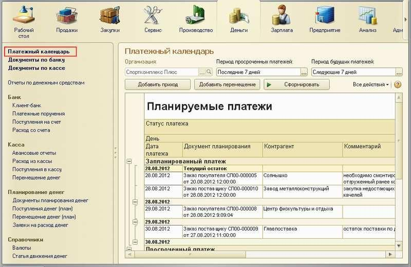
.. |image2| image:: static/images/4/image12.jpg
.. |image3| image:: static/images/4/image23.png
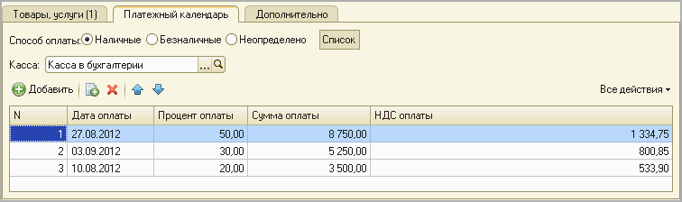
.. |image5| image:: static/images/4/image30.jpg
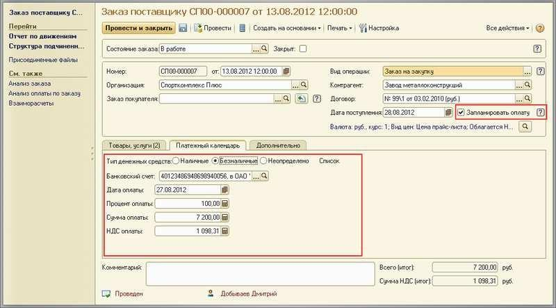
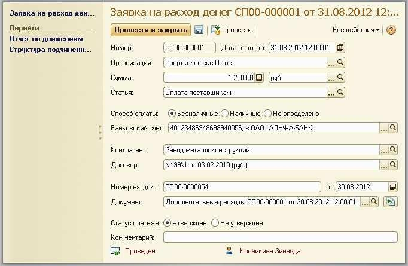
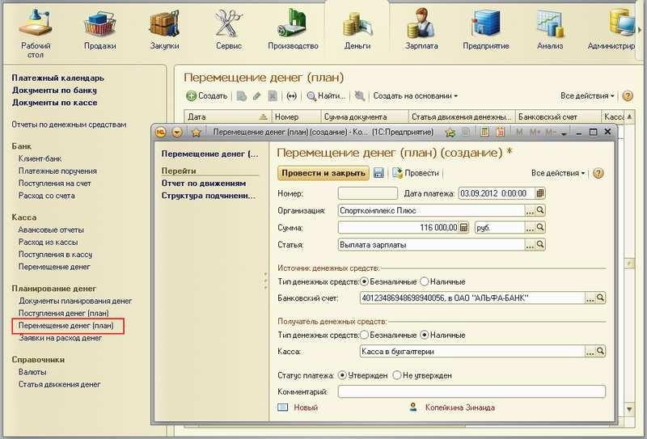
.. |image9| image:: static/images/4/image34.jpg
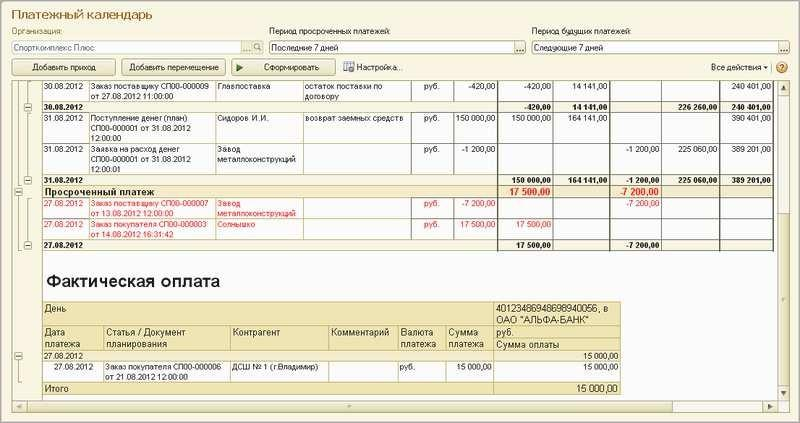
.. |image11| image:: static/images/4/image03.jpg
.. |image12| image:: static/images/4/image04.jpg
.. |image13| image:: static/images/4/image05.jpg
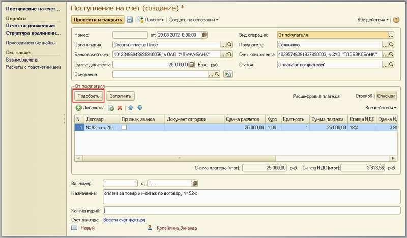
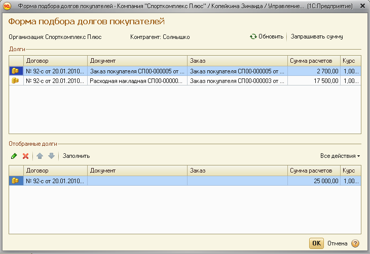
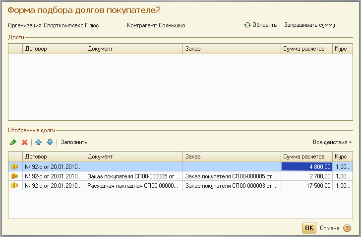
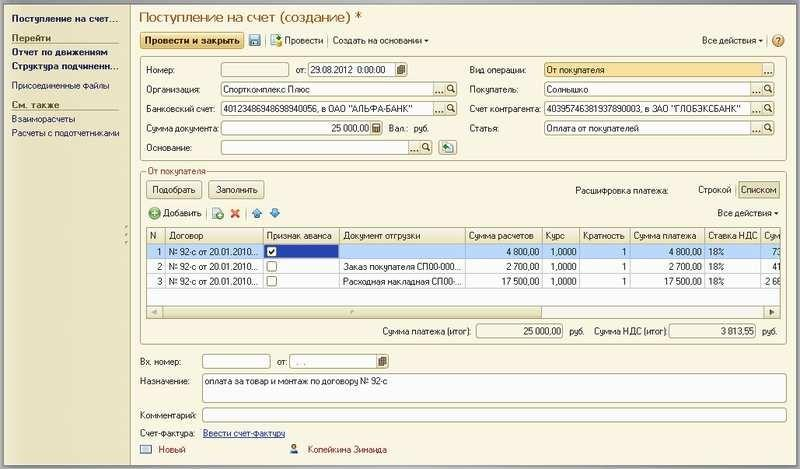
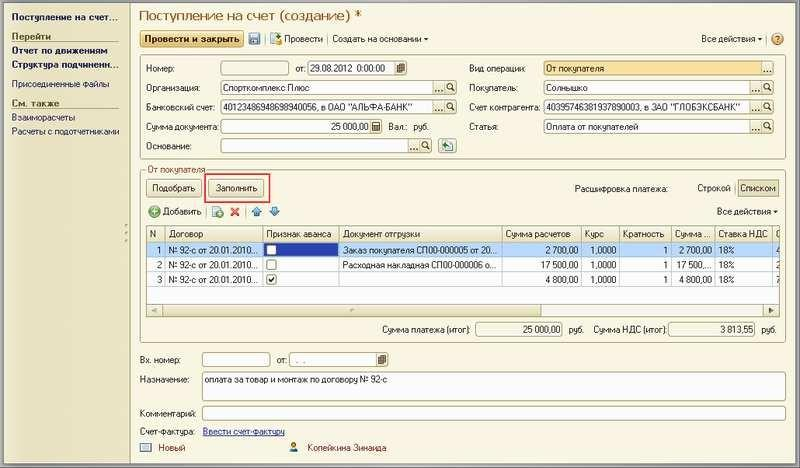
.. |image19| image:: static/images/4/image11.jpg
.. |image20| image:: static/images/4/image13.jpg
.. |image21| image:: static/images/4/image14.jpg
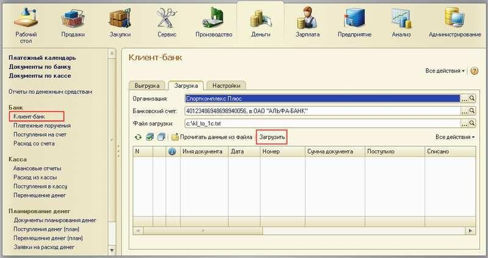
.. |image23| image:: static/images/4/image16.jpg
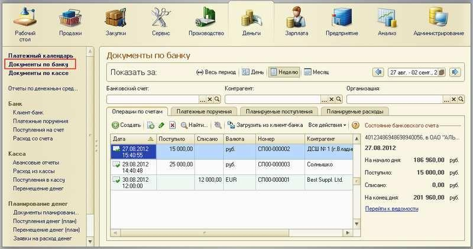
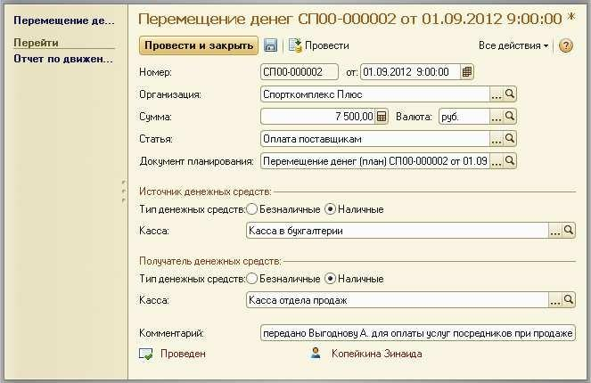
.. |image26| image:: static/images/4/image19.jpg
.. |image27| image:: static/images/4/image20.png
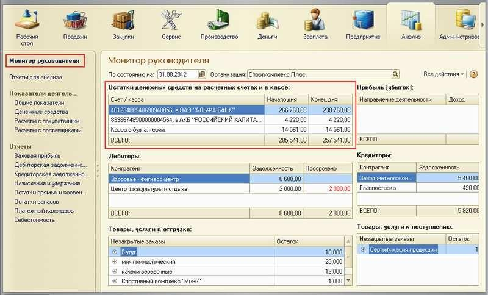
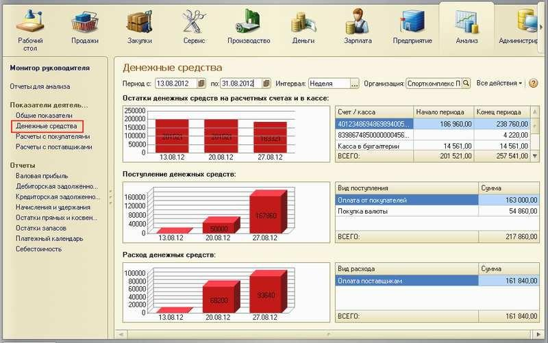
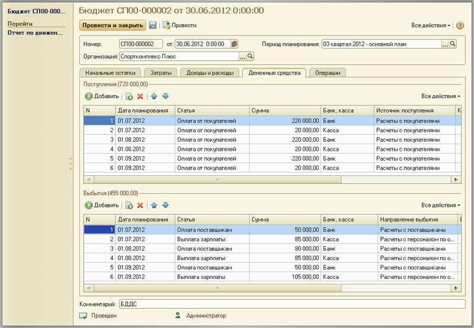
.. |image31| image:: static/images/4/image25.jpg
.. |image32| image:: static/images/4/image26.png
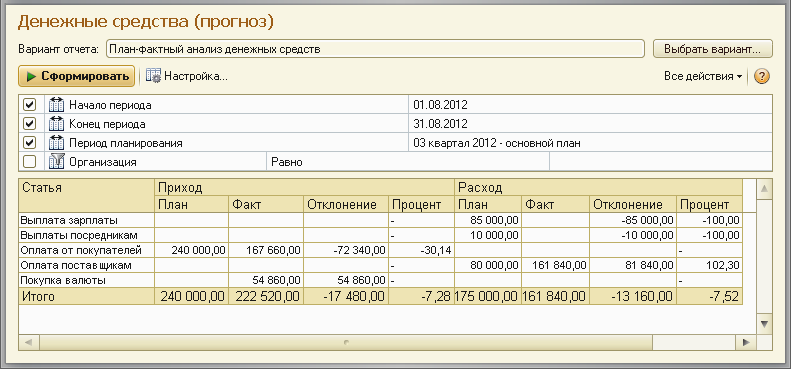
.. |image34| image:: static/images/4/image28.jpg
